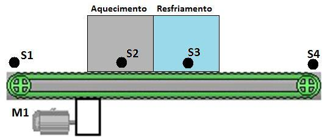

# Projeto RPi 1: Automação de Esteira com Aquecimento e Resfriamento

> 1-) Na esteira abaixo a peça é colocada na posição dada pelo sensor S1, e com isso o motor M1 é ligado, levando a peça até o sistema de aquecimento. Neste instante o motor M1 é desligado e a peça espera 3 segundos, sendo o motor M1 ligado novamente para levar a peça para o resfriamento, quando então o motor M1 é desligado novamente, aguardando agora 4 segundos neste estágio. Decorrido este tempo, o motor M1 é ligado novamente para levar a peça até a posição dada pelo sensor S4, quando o motor é desligado novamente. Elabore um programa que atenda o solicitado.
> 
> **Considerar:**
> - S1, S2, S3 e S4: simular os sensores com Pushbuttons.
> - M1: DC Motor acionado por saída digital GPIO.

<div align="center">
  
</div>


### Link do Código:
- 🔗 [`esteira_termica.py`](./esteira_termica.py)

### Resolução:
```python
# Projeto RPi 1: Automação de Esteira Industrial com Estágios Térmicos
import time

try:
    import RPi.GPIO as GPIO
except ImportError:
    class MockGPIO:
        BCM = OUT = IN = PUD_UP = 0
        def setmode(self, m): pass
        def setup(self, p, mode, pull_up_down=None): pass
        def output(self, p, val): pass
        def input(self, p): return 1
        def cleanup(self): pass
    GPIO = MockGPIO()

# Pinos GPIO (Padrão BCM)
PIN_S1 = 17 # Sensor de Entrada da Peça
PIN_S2 = 27 # Sensor do Aquecedor
PIN_S3 = 22 # Sensor do Resfriador
PIN_S4 = 23 # Sensor de Saída da Peça
PIN_M1 = 24 # Motor DC da Esteira

GPIO.setmode(GPIO.BCM)
GPIO.setup([PIN_S1, PIN_S2, PIN_S3, PIN_S4], GPIO.IN, pull_up_down=GPIO.PUD_UP)
GPIO.setup(PIN_M1, GPIO.OUT)

def aguardar_sensor(pino):
    while GPIO.input(pino) == 1: # Botão pressionado vai a LOW
        time.sleep(0.05)

print("Sistema de Esteira Térmica Iniciado.")
try:
    while True:
        print("Aguardando peça no sensor S1...")
        aguardar_sensor(PIN_S1)
        
        # Liga motor até chegar no aquecedor (S2)
        print("Peça detectada! Ligando motor M1 em direção ao Aquecedor...")
        GPIO.output(PIN_M1, 1)
        aguardar_sensor(PIN_S2)
        
        # Para no aquecedor por 3 segundos
        GPIO.output(PIN_M1, 0)
        print("Aquecendo peça por 3 segundos...")
        time.sleep(3)
        
        # Liga motor até chegar no resfriador (S3)
        print("Ligando motor M1 em direção ao Resfriamento...")
        GPIO.output(PIN_M1, 1)
        aguardar_sensor(PIN_S3)
        
        # Para no resfriamento por 4 segundos
        GPIO.output(PIN_M1, 0)
        print("Resfriando peça por 4 segundos...")
        time.sleep(4)
        
        # Liga motor até chegar na saída (S4)
        print("Ligando motor M1 em direção à Saída (S4)...")
        GPIO.output(PIN_M1, 1)
        aguardar_sensor(PIN_S4)
        
        # Desliga motor na saída
        GPIO.output(PIN_M1, 0)
        print("Peça entregue na saída S4. Ciclo concluído!\n")

except KeyboardInterrupt:
    GPIO.cleanup()
```
