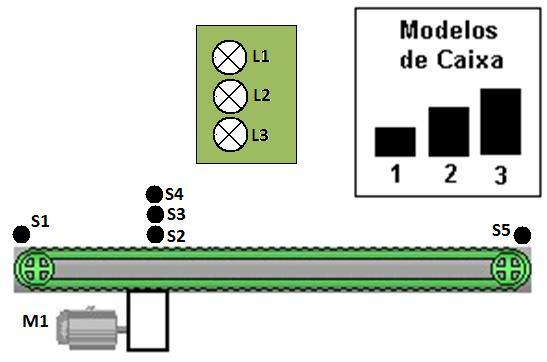

# Projeto RPi 4: Classificador Ótico de Caixas por Altura

> 4-) No sistema de seleção a seguir, quando uma caixa é colocada na posição do sensor S1, o motor M1 é ligado levando a caixa até o sensor S5, quando então é desligado. Elabore um programa para que, de acordo com o tipo de caixa, dada pela figura e identificada no sistema através do acionamento dos sensores S2, S3 e S4, somente a lâmpada correspondente fique ligada. Esta lâmpada deverá ficar ligada até a caixa correspondente chegar ao sensor S5.
> 
> **Considerar:**
> - `S1, S2, S3, S4, S5`: simular os sensores com Pushbuttons.
> - `L1, L2, L3`: simular as lâmpadas indicadoras com LEDs.
> - `M1`: DC Motor acionado via porta GPIO.


<div align="center">
  
</div>

### Link do Código:
- 🔗 [`classificador_caixas.py`](./classificador_caixas.py)

### Resolução:
```python
# Projeto RPi 4: Classificador Industrial de Caixas por Altura com Sensores Múltiplos
import time

try:
    import RPi.GPIO as GPIO
except ImportError:
    class MockGPIO:
        BCM = OUT = IN = PUD_UP = 0
        def setmode(self, m): pass
        def setup(self, p, mode, pull_up_down=None): pass
        def output(self, p, val): pass
        def input(self, p): return 1
        def cleanup(self): pass
    GPIO = MockGPIO()

# Pinos de Entrada (Sensores)
PIN_S1 = 17 # Sensor de entrada
PIN_S2 = 27 # Sensor de altura baixa (Caixa Tipo 1)
PIN_S3 = 22 # Sensor de altura média (Caixa Tipo 2)
PIN_S4 = 23 # Sensor de altura alta (Caixa Tipo 3)
PIN_S5 = 25 # Sensor de fim de curso/saída

# Pinos de Saída (Atuadores e Lâmpadas)
PIN_M1 = 24 # Motor DC
PIN_L1 = 5  # Lâmpada Tipo 1 (Pequena)
PIN_L2 = 6  # Lâmpada Tipo 2 (Média)
PIN_L3 = 13 # Lâmpada Tipo 3 (Grande)

GPIO.setmode(GPIO.BCM)
GPIO.setup([PIN_S1, PIN_S2, PIN_S3, PIN_S4, PIN_S5], GPIO.IN, pull_up_down=GPIO.PUD_UP)
GPIO.setup([PIN_M1, PIN_L1, PIN_L2, PIN_L3], GPIO.OUT)

def apagar_lampadas():
    GPIO.output(PIN_L1, 0)
    GPIO.output(PIN_L2, 0)
    GPIO.output(PIN_L3, 0)

def aguardar_sensor(pino):
    while GPIO.input(pino) == 1:
        time.sleep(0.02)

print("Sistema de Triagem e Classificação de Caixas Ativo.")
try:
    while True:
        apagar_lampadas()
        print("Aguardando caixa no sensor S1...")
        aguardar_sensor(PIN_S1)
        
        # Liga motor
        GPIO.output(PIN_M1, 1)
        print("Caixa inserida! Conduzindo pela esteira para leitura ótica...")
        
        # Leitura dos sensores de altura na passagem
        s2_ativo = (GPIO.input(PIN_S2) == 0)
        s3_ativo = (GPIO.input(PIN_S3) == 0)
        s4_ativo = (GPIO.input(PIN_S4) == 0)
        
        if s4_ativo:
            print(">> Classificação: Caixa GRANDE (Tipo 3)")
            GPIO.output(PIN_L3, 1)
        elif s3_ativo:
            print(">> Classificação: Caixa MÉDIA (Tipo 2)")
            GPIO.output(PIN_L2, 1)
        else:
            print(">> Classificação: Caixa PEQUENA (Tipo 1)")
            GPIO.output(PIN_L1, 1)
            
        # Conduz até S5
        aguardar_sensor(PIN_S5)
        GPIO.output(PIN_M1, 0)
        apagar_lampadas()
        print("Caixa entregue em S5. Ciclo de triagem finalizado.\n")

except KeyboardInterrupt:
    GPIO.cleanup()
```
