# 💻 FIAP • Engenharia da Computação
### Portfólio Acadêmico e Repositório Oficial de Engenharia • Computational Thinking for Engineering (2022)

<p align="center">
  <a href="https://guimemee.github.io/fiap-computational-thinking-for-engineering/">
    
  </a>
</p>

<table>
  <!-- Bloco 1: Informações Pessoais (Card Duplo) -->
  <tr>
    <th colspan="2" align="center">Informações Pessoais</th>
  </tr>
  <tr>
    <td colspan="2" align="center" valign="middle">
      
    </td>
  </tr>

  <!-- Bloco 2: Informações sobre o Repositório (Card Duplo) -->
  <tr>
    <th colspan="2" align="center">FIAP - Engenharia de computação — Informações sobre o repositório</th>
  </tr>
  <tr>
    <td colspan="2" align="center" valign="middle">
      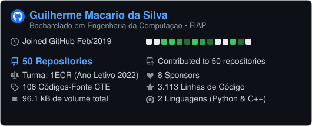
    </td>
  </tr>

  <!-- Bloco 3: Métricas de Repositório (Card Duplo) -->
  <tr>
    <th colspan="2" align="center">📅 Isometric commit calendar</th>
  </tr>
  <tr>
    <td colspan="2" align="center" valign="middle">
      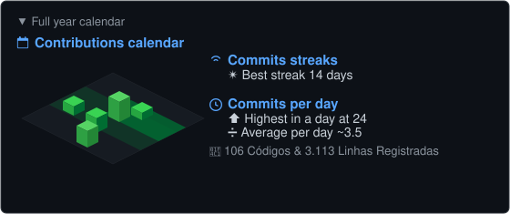
    </td>
  </tr>

  <!-- Bloco 4: Linguagens (Card Duplo) -->
  <tr>
    <th colspan="2" align="center">🈷️ Languages activity</th>
  </tr>
  <tr>
    <td colspan="2" align="center" valign="middle">
      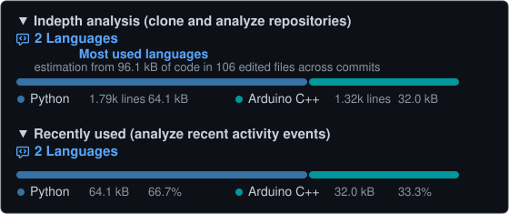
    </td>
  </tr>

  <!-- Bloco 3: Painel Duplo de Tecnologias -->
  <tr>
    <th colspan="2" align="center">🏛️ FIAP - 1ECR - Engenharia de computação 2022</th>
  </tr>
  <tr>
    <td colspan="2" align="center" valign="middle">
      
    </td>
  </tr>

  <!-- Bloco 4: Global Solutions (Painel Duplo) -->
  <tr>
    <th colspan="2" align="center">🌐 Global Solution (Projetos Integrados)</th>
  </tr>
  <tr>
    <td align="left" valign="top">
      <p><small>🔗 <a href="#global-solution-1ecr-1_2022-veículos-elétricos"><b>GS 1 (1ECR 1_2022): Veículos Elétricos</b></a></small></p>
      
    </td>
    <td align="left" valign="top">
      <p><small>🔗 <a href="#global-solution-22022-locação-de-frota-de-veículos-elétricos"><b>GS 2 (2/2022): Locação de Frota Elétrica</b></a></small></p>
      
    </td>
  </tr>

  <!-- Bloco 5: Challenge Sprints (HAOC) (Painel Duplo) -->
  <tr>
    <th colspan="2" align="center">⚡ Challenge Sprints — Hospital Alemão Oswaldo Cruz (HAOC)</th>
  </tr>
  <tr>
    <td align="left" valign="top">
      <p><small>🔗 <a href="#sprint-1-proposta-do-challenge-hardware-software-e-cronograma"><b>Sprint 1: Requisitos, Ideia Consolidada e Objetivo</b></a></small></p>
    </td>
    <td align="left" valign="top">
      <p><small>🔗 <a href="#sprint-3-custo-de-desenvolvimento-e-protótipo-de-engenharia"><b>Sprint 3: Hardware, BOM (R$ 1.840,00) e ESP32</b></a></small></p>
    </td>
  </tr>
  <tr>
    <td align="left" valign="top">
      <p><small>🔗 <a href="#sprint-2-ideia-consolidada-arquitetura-e-diagrama-de-sistema"><b>Sprint 2: Arquitetura 4 Camadas e Diagrama</b></a></small></p>
      
    </td>
    <td align="left" valign="top">
      <p><small>🔗 <a href="#sprint-4-relatório-final-integrado-e-conclusão"><b>Sprint 4: Cronograma Anual e Conclusão</b></a></small></p>
      
    </td>
  </tr>

  <!-- Bloco 6: Provas Avaliativas (Headers Brancos + 6 Linhas Compactas) -->
  <tr>
    <th colspan="2" align="center">📝 Avaliações do ano 2022 - 1ECR - Computational Thinking for Engineering</th>
  </tr>
  <tr>
    <th width="50%" align="center">🐍 Programação em Python</th>
    <th width="50%" align="center">🤖 Automação e Microcontroladores (Arduino C++)</th>
  </tr>
  <tr>
    <td align="left" valign="top">
      <p><small>📝 <a href="#precificação-da-gasolina-comum-gasolina-c"><b>1: Precificação da Gasolina Comum (Gasolina C)</b></a></small></p>
    </td>
    <td align="left" valign="top">
      <p><small>📝 <a href="#prova-1-índice-de-risco-de-ataques-terroristas-bin-laden"><b>1 — Índice de Risco de Ataques (Bin Laden)</b></a></small></p>
    </td>
  </tr>
  <tr>
    <td align="left" valign="top">
      <p><small>📝 <a href="#fatura-de-energia-elétrica-residencial-tusd--te"><b>2: Fatura de Energia Residencial (TUSD / TE)</b></a></small></p>
    </td>
    <td align="left" valign="top">
      <p><small>📝 <a href="#prova-2-sinalizador-luminoso-de-ambulância-samu"><b>2 — Sinalizador de Ambulância SAMU</b></a></small></p>
    </td>
  </tr>
  <tr>
    <td align="left" valign="top">
      <p><small>📝 <a href="#cálculo-de-médias-fiap-com-descarte-de-menor-nota-e-exame"><b>3: Cálculo de Médias FIAP com Descarte</b></a></small></p>
    </td>
    <td align="left" valign="top">
      <p><small>📝 <a href="#prova-3-automação-de-esteira-industrial-com-aquecimento-e-resfriamento"><b>3 — Esteira com Aquecimento e Resfriamento</b></a></small></p>
    </td>
  </tr>
  <tr>
    <td align="left" valign="top">
      <p><small>📝 <a href="#corretor-automático-de-gabarito-de-provas"><b>4: Corretor Automático de Gabarito de Provas</b></a></small></p>
    </td>
    <td align="left" valign="top">
      <p><small>📝 <a href="#prova-4-contador-de-peças-industriais-com-alerta-de-lotação-de-caixa"><b>4 — Contador de Peças e Alerta de Caixa</b></a></small></p>
    </td>
  </tr>
  <tr>
    <td align="left" valign="top">
      <p><small>📝 <a href="#jogo-jokenpô-automatizado-com-placar"><b>5: Jogo Jokenpô Automatizado com Placar</b></a></small></p>
    </td>
    <td align="left" valign="top">
      <p><small>📝 <a href="#prova-5-painel-de-operador-com-botão-de-reset-e-reinício-de-ciclo"><b>5 — Painel de Operador com Botão de Reset</b></a></small></p>
    </td>
  </tr>
  <tr>
    <td align="left" valign="top">
      <p><small>📝 <a href="#jogo-da-forca-interativo"><b>6: Jogo da Forca Interativo</b></a></small></p>
      
    </td>
    <td align="left" valign="top">
      <p><small>📝 <a href="#prova-6-classificador-ótico-de-caixas-por-altura-com-sensores-múltiplos"><b>6 — Classificador Ótico por Altura</b></a></small></p>
      
    </td>
  </tr>

  <!-- Bloco 7: Exercícios Práticos de Laboratório -->
  <tr>
    <th colspan="2" align="center">📦 Exercícios do ano 2022 - 1ECR - Computational Thinking for Engineering</th>
  </tr>
  <tr>
    <th width="50%" align="center">📚 Exercícios Práticos de Laboratório (Python)</th>
    <th width="50%" align="center">🛠️ Exercícios Práticos de Laboratório (Arduino C++)</th>
  </tr>
  <tr>
    <td align="left" valign="top">
      <p><small>📦 <a href="#módulo-1-estruturas-sequenciais-variáveis-e-operações-aritméticas"><b>Módulo 1: Estruturas Sequenciais e Aritmética</b></a></small></p>
      <p><small>📦 <a href="#módulo-2-estruturas-de-decisão-e-desvios-condicionais-if-elif-else"><b>Módulo 2: Estruturas de Decisão (if / elif / else)</b></a></small></p>
      <p><small>📦 <a href="#módulo-3-estruturas-de-repetição-e-laços-for-while"><b>Módulo 3: Estruturas de Repetição (for / while)</b></a></small></p>
      <p><small>📦 <a href="#módulo-4-funções-modulares-e-algoritmos-matemáticos-def"><b>Módulo 4: Funções Modulares e Algoritmos (def)</b></a></small></p>
      <p><small>📦 <a href="#módulo-5-estruturas-de-dados-listas-e-dicionários"><b>Módulo 5: Estruturas de Dados (Listas e Dicionários)</b></a></small></p>
      
    </td>
    <td align="left" valign="top">
      <p><small>🔧 <a href="#projeto-1-led-pisca-pisca-laboratório-básico-de-hardware"><b>Projeto 1: LED Pisca Pisca &amp; Média Serial</b></a></small></p>
      <p><small>🔧 <a href="#projeto-2-led-pisca-pisca-com-delay-decremental"><b>Projeto 2: LED Decremental &amp; Semáforo 3 Tempos</b></a></small></p>
      <p><small>🔧 <a href="#projeto-3-luz-pulsante-modulação-pwm-incremental"><b>Projeto 3: Luz Pulsante &amp; Semáforo com Botão</b></a></small></p>
      <p><small>🔧 <a href="#projeto-4-meu-primeiro-botão-pushbutton-chave-tátil"><b>Projeto 4: Pushbutton &amp; Controle de Brilho PWM</b></a></small></p>
      <p><small>🔧 <a href="#projeto-5-led-controlado-por-potenciômetro-entrada-analógica-a5"><b>Projeto 5: Potenciômetro &amp; Iluminação Pública LDR</b></a></small></p>
      <p><small>🔧 <a href="#projeto-6-led-inteligente-com-sensor-ldr"><b>Projeto 6: LED Inteligente &amp; Display 7 Segmentos</b></a></small></p>
      <p><small>🔧 <a href="#projeto-7-calibrando-o-led-inteligente-via-monitor-serial"><b>Projeto 7: Calibração Serial &amp; Sensor Ultrassônico</b></a></small></p>
      <p><small>🔧 <a href="#projeto-8-leds-controlados-pelo-teclado-via-porta-serial"><b>Projeto 8: Teclado Serial &amp; Automação de Circuitos</b></a></small></p>
      
    </td>
  </tr>
</table>

---

## 1. Global Solutions (Projetos Integrados)

<a id="global-solution-12022-veículos-elétricos"></a>
<a id="global-solution-1ecr-1_2022-veículos-elétricos"></a>
### Global Solution 1ECR 1_2022: Veículos Elétricos

> **Global Solution 1ECR 1_2022 - Guilherme Macario**  
> 
> Veículos elétricos costumam ser mais econômicos que veículos a combustão (gasolina, etanol ou diesel), também podemos considerar os custos com a manutenção e o apelo da sustentabilidade.
> 
> Desenvolver um programa em Python para calcular o consumo médio de um veículo elétrico e de um veículo a combustão de porte similar, realizando a comparação.
> 
> O programa também deverá perguntar ao usuário se ele gostaria de calcular o consumo novamente (repetição) antes de sua finalização, caso SIM, entrar com novos dados para o cálculo, caso NÃO, fechar o programa.
> 
> O usuário deverá inserir as informações de todas as variáveis de entrada, pois elas não são valores fixos definidos dentro do código.
> 
> Segue referência para auxiliá-los nos cálculos: https://canaltech.com.br/carros/carros-eletricos-saiba-calcular-o-consumo-medio-198023/
> 
> Bom trabalho a todos!  


#### Link do Código:
- 🔗 [`GS1_2022_CTE.py`](./06_Global_Solution_Veiculos_Eletricos/GS1_2022_CTE.py)

#### Resolução:
```python
def calcular_consumo():
    cap_bateria_kwh = float(input("Capacidade bateria (kWh): "))
    autonomia_ev_km = float(input("Autonomia EV (km): "))
    tarifa_kwh = float(input("Tarifa energia (R$/kWh): "))
    
    consumo_ev_km = cap_bateria_kwh / autonomia_ev_km
    custo_ev_km = consumo_ev_km * tarifa_kwh
    
    consumo_combustao_kml = float(input("Consumo Combustão (km/L): "))
    preco_combustivel_l = float(input("Preço Combustível (R$/L): "))
    custo_combustao_km = preco_combustivel_l / consumo_combustao_kml
    
    distancia = float(input("Distância simulada da viagem (km): "))
    
    total_ev = custo_ev_km * distancia
    total_comb = custo_combustao_km * distancia
    economia = total_comb - total_ev
    
    print(f"\nCusto Total EV: R$ {total_ev:.2f}")
    print(f"Custo Total Combustão: R$ {total_comb:.2f}")
    if economia > 0:
        print(f"Economia EV: R$ {economia:.2f} ({((economia/total_comb)*100):.1f}%)")

while True:
    calcular_consumo()
    if input("\nNovo cálculo? (S/N): ").strip().upper() != 'S':
        break
```

---

<a id="global-solution-22022-locação-de-frota-de-veículos-elétricos"></a>
### Global Solution 2/2022: Locação de Frota de Veículos Elétricos

> Desenvolver um programa em Python para gerenciamento e tarifação de locação de frota de veículos elétricos por categoria (Caminhão, Furgão, Picape, SUV, Hatchback, Sedan), realizando leitura de base de dados externa (`ListaDeCarros.txt`), cálculo tarifário com base nas faixas de tempo e emissão de comprovante em arquivo (`ResumoAluguel.txt`).

#### Link do Código:
- 🔗 [`GS2_2022_CTE.py`](./06_Global_Solution_2_Locacao_Frota/GS2_2022_CTE.py) • 📄 [`ListaDeCarros.txt`](./06_Global_Solution_2_Locacao_Frota/ListaDeCarros.txt)

#### Resolução:
```python
import os

carros = []
taxaPadrao = 0

with open("ListaDeCarros.txt", "r", encoding='utf-8') as arquivo:
    carros = arquivo.read().split("\n")

print("Caminhão\n"
      "Furgão\n"
      "Picape\n"
      "SUV\n"
      "HATCHBACK\n"
      "SEDAN\n")

escolha = input("Escolha uma categoria carro elétrico disponível:").upper()

while escolha != "CAMINHÃO" and escolha != "FURGÃO" and escolha != "PICAPE" and escolha != "SUV" and escolha != "HATCHBACK" and escolha != "SEDAN":
    escolha = input("Digite uma das categorias (Caminhão, Furgão, Picape, SUV, Hatchback, Sedan):").upper()

if escolha == "CAMINHÃO":
    taxaPadrao = 15.90
    for caminhao in carros:
        if caminhao.startswith("Caminhão"):
            print(caminhao)
    carro = input("Selecione um Caminhão:")
elif escolha == "FURGÃO":
    taxaPadrao = 12.90
    for furgao in carros:
        if furgao.startswith("Furgão"):
            print(furgao)
    carro = input("Selecione um Furgão:")
elif escolha == "PICAPE":
    taxaPadrao = 8.90
    for picape in carros:
        if picape.startswith("Picape"):
            print(picape)
    carro = input("Selecione uma Picape:")
elif escolha == "SUV":
    taxaPadrao = 6.90
    for SUV in carros:
        if SUV.startswith("SUV"):
            print(SUV)
    carro = input("Selecione uma SUV:")
elif escolha == "HATCHBACK":
    taxaPadrao = 4.90
    for hatchback in carros:
        if hatchback.startswith("Hatchback"):
            print(hatchback)
    carro = input("Selecione um Hatchback:")
elif escolha == "SEDAN":
    taxaPadrao = 3.90
    for sedan in carros:
        if sedan.startswith("Sedan"):
            print(sedan)
    carro = input("Selecione um Sedan:")

os.system('cls')

print(f"\nAté 6 horas: R$ {taxaPadrao} mais R$ 0,70 (por minuto) \n"
      f"A partir de 6 horas: R$ {taxaPadrao} mais R$ 0,40 (por minuto)\n"
      f"A partir de 12 horas: R$ {taxaPadrao} mais R$ 0,30 (por minuto)\n"
      f"A partir de 24 horas: R$ {taxaPadrao} mais R$ 0,20 (por minuto)\n"
      f"A partir de 48 horas: R$ {taxaPadrao} mais R$ 0,18 (por minuto)\n")

horas = float(input("Quantas horas gostaria de utilizar o carro? "))

if horas > 0 and horas < 6:
    preco = (horas * 60) * 0.7 + taxaPadrao
elif horas >= 6 and horas < 12:
    preco = (horas * 60) * 0.4 + taxaPadrao
elif horas >= 12 and horas < 24:
    preco = (horas * 60) * 0.3 + taxaPadrao
elif horas >= 24 and horas < 48:
    preco = (horas * 60) * 0.2 + taxaPadrao
elif horas >= 48:
    preco = (horas * 60) * 0.18 + taxaPadrao

print((f"O aluguel do carro elétrico {carro}, no período de {round(horas)}h, ficará no valor de R$%.2f."%preco))
print("Verifique o arquivo ResumoAluguel.txt")

with open("ResumoAluguel.txt", "a", encoding='utf-8') as arquivo:
    arquivo.write(f"O aluguel do carro elétrico {carro}, no período de {round(horas)}h, ficará no valor de R$%.2f.\n"%preco)
```

---

---

## 2. Provas Avaliativas Formais

<a id="matéria-programação-em-python"></a>
<a id="matéria-programação-em-python-7-provas"></a>
### 🐍 Matéria: Programação em Python

### Precificação da Gasolina Comum (Gasolina C)

> **Prova 1 - ECR - Guilherme Macario**
> 
> Faça um programa para calcular o preço final da gasolina comum que chega no posto de combustível.
> 
> “As distribuidoras de combustível compram nas refinarias a gasolina tipo A. Atendendo à legislação brasileira, a gasolina vendida nos postos deve ser misturada com etanol anidro. Desta maneira, no preço que o consumidor paga está incluído o preço de realização da Petrobras, o custo do etanol (que é definido livremente pelos seus produtores) e os custos e as margens de comercialização das distribuidoras e dos postos revendedores, bem como todos os impostos devidos.” Fonte: Petrobras
> 
> Vamos admitir as seguintes informações e fórmulas:
> − O usuário entrará com o preço por litro da gasolina tipo A na refinaria.
> − O usuário entrará com o preço por litro do etanol anidro nas usinas produtoras.
> − A gasolina tipo C (gasolina na bomba) é igual a 73% de gasolina tipo A mais 27% de etanol anidro.
> `valor_gasolinaC = valor_gasolinaA * 0.73 + valor_etanol_anidro * 0.27`
> − As distribuidoras que são responsáveis pela mistura da gasolina A e do etanol anidro, além da entrega aos postos, impactam no custo do preço do combustível em 5%.
> `valor_distribuidora = valor_gasolinaC * 0.05`
> − Os tributos federais são: CIDE (Contribuição de Intervenção no Domínio Econômico), PIS/PASEP (Programa de Integração Social/ Programa de Formação do Patrimônio do Servidor Público) e COFINS (Contribuição para o Financiamento da Seguridade Social), que correspondem a 20%.
> `valor_tributos_federais = (valor_gasolinaC + valor_distribuidora) * 0.2`
> − Os custos e lucros de distribuição e revenda é de aproximadamente 15%.
> `custos_lucros = (valor_gasolinaC + valor_distribuidora + valor_tributos_federais) * 0.15`
> − O imposto estadual o ICMS (Imposto sobre Circulação de Mercadorias e Serviços) corresponde a 25%.
> `icms = (valor_gasolinaC + valor_distribuidora + valor_tributos_federais + custos_lucros) * 0.25`
> 
> Para calcular o preço final da gasolina comum (gasolina C) que chega nos postos, segue a fórmula:
> `valor_gasolina_final = valor_gasolinaC + valor_distribuidora + valor_tributos_federais + icms + custos_lucros`
> 
> **Variáveis de entrada solicitadas ao usuário:**
> ➢ Valor da gasolina tipo A por litro
> ➢ Valor do etanol anidro por litro
> 
> **Variáveis de saída para apresentar na tela:**
> ➢ Valor da gasolina C
> ➢ Valor cobrado pela distribuidora
> ➢ Valor dos tributos federais (CIDE, PIS/PASEP e COFINS)
> ➢ Valor do ICMS
> ➢ Valor dos custos e lucros de distribuição e revenda
> ➢ Valor final da gasolina
> 
> **EXEMPLO DE ENTRADA / EXEMPLO DE SAÍDA:**
> * Valor da gasolina tipo A por litro = R$ 3.86
> * Valor do etanol anidro por litro = R$ 3.63
> * Valor da gasolina C = R$ 3.80
> * Valor cobrado pela distribuidora responsável pela mistura = R$ 0.19
> * Valor total dos tributos federais (CIDE, PIS/PASEP e COFINS) = R$ 0.80
> * Valor do ICMS = R$ 1.38
> * Valor dos custos e lucros de distribuição e revenda = R$ 0.72
> * Valor final da gasolina que chega no posto = R$ 6.88

#### Link do Código:
- 🔗 [`questao2_CTE.py`](./01_Checkpoints_Python_1_Semestre/Checkpoint_1_Sistemas_Tarifas_Energia_Combustivel/questao2_CTE.py)

#### Resolução:
```python
valor_gasolinaA = float(input("Digite o valor da gasolina tipo A por litro: R$ "))
valor_etanol_anidro = float(input("Digite o valor do etanol anidro por litro: R$ "))

valor_gasolinaC = (valor_gasolinaA * 0.73) + (valor_etanol_anidro * 0.27)
valor_distribuidora = valor_gasolinaC * 0.05
valor_tributos_federais = (valor_gasolinaC + valor_distribuidora) * 0.20
custos_lucros = (valor_gasolinaC + valor_distribuidora + valor_tributos_federais) * 0.15
icms = (valor_gasolinaC + valor_distribuidora + valor_tributos_federais + custos_lucros) * 0.25

valor_gasolina_final = valor_gasolinaC + valor_distribuidora + valor_tributos_federais + icms + custos_lucros

print(f"\nValor da gasolina C = R$ {valor_gasolinaC:.2f}")
print(f"Valor cobrado pela distribuidora responsável pela mistura = R$ {valor_distribuidora:.2f}")
print(f"Valor total dos tributos federais (CIDE, PIS/PASEP e COFINS) = R$ {valor_tributos_federais:.2f}")
print(f"Valor do ICMS = R$ {icms:.2f}")
print(f"Valor dos custos e lucros de distribuição e revenda = R$ {custos_lucros:.2f}")
print(f"Valor final da gasolina que chega no posto = R$ {valor_gasolina_final:.2f}")
```

---

<a id="fatura-de-energia-elétrica-residencial-tusd--te"></a>
### Fatura de Energia Elétrica Residencial (TUSD / TE)

> **Prova 1 - ECR - Guilherme Macario**
> 
> Todo mês é feita a leitura do medidor de energia da sua residência para saber qual o consumo em kWh. O consumo mensal é calculado pela diferença entre a leitura do mês atual e a leitura do mês anterior.
> 
> **Variáveis de entrada solicitadas ao usuário:**
> ✓ Leitura anterior (kWh)
> ✓ Leitura atual (kWh)
> 
> **Variáveis de saída para apresentar na tela:**
> ✓ Consumo do mês (kWh)
> ✓ TUSD
> ✓ TE
> ✓ PIS/PASEP
> ✓ COFINS
> ✓ CIP
> ✓ Total a pagar (R$)
> 
> Considerando as tarifas abaixo com ICMS (Imposto sobre Circulação de Mercadorias e Serviços) = 25%, os tributos e o CIP (Contribuição para Custeio do Serviço de Iluminação Pública), calcule o valor cobrado pelo consumo mensal. Estamos desconsiderando a tarifa de Bandeira Tarifária.
> 
> | TARIFAS | ALÍQUOTA |
> | :--- | :--- |
> | **TUSD** (Tarifa de Uso do Sistema de Distribuição de Energia Elétrica) | 40,942% |
> | **TE** (Tarifa de Energia) | 38,317% |
> 
> Para cálculo da TUSD e da TE, você usa as seguintes fórmulas:
> * `TUSD = consumo do mês * (alíquota/100)`
> * `TE = consumo do mês * (alíquota/100)`
> * `PIS/PASEP = consumo do mês * (1.00/100)`
> * `COFINS = consumo do mês * (4.62/100)`
> * `CIP (Iluminação Pública) igual a R$ 24,01.`
> 
> Para cálculo do total a pagar, você usa a seguinte fórmula:
> `Total a pagar = TUSD + TE + PIS/PASEP + COFINS + CIP`
> 
> **EXEMPLO DE ENTRADA / EXEMPLO DE SAÍDA:**
> * Leitura anterior (kWh) = 57521
> * Leitura atual (kWh) = 57761
> * Consumo do mês (kWh) = 240
> * TUSD = R$ 98.26
> * TE = R$ 91.96
> * PIS/PASEP = R$ 2.40
> * COFINS = R$ 11.09
> * CIP = R$ 24.01
> * Total a pagar (R$) = 227.72

#### Link do Código:
- 🔗 [`questao3_CTE.py`](./01_Checkpoints_Python_1_Semestre/Checkpoint_1_Sistemas_Tarifas_Energia_Combustivel/questao3_CTE.py)

#### Resolução:
```python
leitura_anterior = float(input("Digite a leitura anterior (kWh): "))
leitura_atual = float(input("Digite a leitura atual (kWh): "))

consumo_mes = leitura_atual - leitura_anterior

tusd = consumo_mes * (40.942 / 100.0)
te = consumo_mes * (38.317 / 100.0)
pis_pasep = consumo_mes * (1.00 / 100.0)
cofins = consumo_mes * (4.62 / 100.0)
cip = 24.01

total_pagar = tusd + te + pis_pasep + cofins + cip

print(f"\nConsumo do mês (kWh) = {consumo_mes:.0f}")
print(f"TUSD = R$ {tusd:.2f}")
print(f"TE = R$ {te:.2f}")
print(f"PIS/PASEP = R$ {pis_pasep:.2f}")
print(f"COFINS = R$ {cofins:.2f}")
print(f"CIP = R$ {cip:.2f}")
print(f"Total a pagar (R$) = {total_pagar:.2f}")
```

---

### Cálculo de Médias FIAP com Descarte de Menor Nota e Exame

> **Prova 2 - ECR - Guilherme Macario**
> 
> Faça um programa para calcular a média final de uma disciplina.
> 
> **Variáveis de entrada solicitadas ao aluno (as variáveis são numéricas do tipo inteiro):**
> • 1º semestre:
>   o Checkpoint 1
>   o Checkpoint 2
>   o Checkpoint 3
>   o Entregável 1
>   o Entregável 2
>   o Global Solutions
> • 2º semestre:
>   o Checkpoint 1
>   o Checkpoint 2
>   o Checkpoint 3
>   o Entregável 1
>   o Entregável 2
>   o Global Solutions
> • Exame (caso o aluno tenha ficado)
> 
> **Variáveis de saída para apresentar na tela:**
> ✓ Média do 1º semestre
> ✓ Média do 2º semestre
> ✓ Média parcial do ano
> ✓ Média final
> 
> **Observações:**
> • O programa deverá descartar a menor nota entre os três checkpoints, em cada semestre.
> • O usuário deverá entrar com as notas de 0 a 100.
> • As variáveis de saída não devem apresentar casas decimais.
> 
> **Fórmulas para serem calculadas em cada semestre:**
> `Média do Project Checkpoint Challenge & Feedbacks = (Checkpoint 1 + Checkpoint 2 + Entregável 1 + Entregável 2) / 4`
> `Média do semestre = Média do Project Checkpoint Challenge & Feedbacks * 0,4 + Global Solutions * 0,6`
> 
> **Fórmula para a média parcial do ano:**
> `Média parcial do ano = Média do 1º semestre * 0,4 + Média do 2º semestre * 0,6`
> 
> **Condições:**
> − Se a média parcial do ano for maior igual a 60 pontos, o aluno está aprovado na disciplina (mostrar a mensagem aprovado e a nota da média final).
> − Se a média parcial do ano for menor que 60 e maior igual a 40 pontos, o aluno está de exame. A nota para aprovação no exame é de acordo com a seguinte fórmula:
>   `Nota para aprovação = 120 – Média parcial do ano`
>   ✓ Se a nota do exame for maior igual a nota para aprovação, calcular a nova média final, de acordo com a fórmula abaixo, mostrar a mensagem aprovação e a nota da média final:
>     `Média final = (Exame + Média parcial do ano) / 2`
>   ✓ Se a nota do exame for menor que a nota para aprovação, mostrar a mensagem reprovado e a nota da média final.
> − Se a média parcial do ano for menor que 40 pontos, o aluno está reprovado (mostrar a mensagem reprovado e a nota da média final).

#### Link do Código:
- 🔗 [`questao1_medias_CTE.py`](./01_Checkpoints_Python_1_Semestre/Checkpoint_2_Calculo_Medias_Descarte_Exame/questao1_medias_CTE.py)

#### Resolução:
```python
print("=== ENTRADA DE NOTAS DO 1º SEMESTRE ===")
cp1_1s = int(input("Checkpoint 1: "))
cp2_1s = int(input("Checkpoint 2: "))
cp3_1s = int(input("Checkpoint 3: "))
ent1_1s = int(input("Entregável 1: "))
ent2_1s = int(input("Entregável 2: "))
gs_1s = int(input("Global Solutions: "))

cps_1s = sorted([cp1_1s, cp2_1s, cp3_1s])
media_checkpoints_1s = (cps_1s[1] + cps_1s[2] + ent1_1s + ent2_1s) / 4.0
media_1s = (media_checkpoints_1s * 0.4) + (gs_1s * 0.6)

print("\n=== ENTRADA DE NOTAS DO 2º SEMESTRE ===")
cp1_2s = int(input("Checkpoint 1: "))
cp2_2s = int(input("Checkpoint 2: "))
cp3_2s = int(input("Checkpoint 3: "))
ent1_2s = int(input("Entregável 1: "))
ent2_2s = int(input("Entregável 2: "))
gs_2s = int(input("Global Solutions: "))

cps_2s = sorted([cp1_2s, cp2_2s, cp3_2s])
media_checkpoints_2s = (cps_2s[1] + cps_2s[2] + ent1_2s + ent2_2s) / 4.0
media_2s = (media_checkpoints_2s * 0.4) + (gs_2s * 0.6)

media_parcial = (media_1s * 0.4) + (media_2s * 0.6)

print(f"\nMédia 1º Semestre = {media_1s:.0f}")
print(f"Média 2º Semestre = {media_2s:.0f}")
print(f"Média Parcial = {media_parcial:.0f}")

if media_parcial >= 60:
    print(f"Aprovado! Média Final = {media_parcial:.0f}")
elif media_parcial >= 40:
    print("Aluno de EXAME!")
    nota_aprovacao = 120 - media_parcial
    exame = int(input(f"Digite a nota do Exame (mínimo necessário: {nota_aprovacao:.0f}): "))
    media_final = (exame + media_parcial) / 2.0
    if exame >= nota_aprovacao:
        print(f"Aprovado com exame! Média Final = {media_final:.0f}")
    else:
        print(f"Reprovado no exame! Média Final = {media_final:.0f}")
else:
    print(f"Reprovado direto! Média Final = {media_parcial:.0f}")
```

---

### Corretor Automático de Gabarito de Provas

> **Prova 3 - ECR - Guilherme Macario**
> 
> Faça um programa para verificar a nota do estudante em uma avaliação com 10 questões de múltipla escolha. O programa deve perguntar a resposta de cada questão, comparar com o gabarito da avaliação e calcular a nota total (atribuir 1 ponto para cada resposta correta).
> 
> **Gabarito da avaliação:**
> 01 - A | 02 - B | 03 - C | 04 - D | 05 - E | 06 - E | 07 - D | 08 - C | 09 - B | 10 - A
> 
> Antes da correção o programa deverá mostrar o gabarito da avaliação na tela.  
> O programa deverá executar, conforme exemplo abaixo:
> 
> **EXEMPLO DE ENTRADA / EXEMPLO DE SAÍDA:**
> Gabarito da avaliação: 01 - A  02 - B  03 - C  04 - D  05 - E  06 - E  07 - D  08 - C  09 - B  10 - A  
> Resposta da questão 1: A  
> Resposta da questão 2: C  
> Resposta da questão 3: C  
> Resposta da questão 4: D  
> Resposta da questão 5: E  
> Resposta da questão 6: E  
> Resposta da questão 7: D  
> Resposta da questão 8: C  
> Resposta da questão 9: B  
> Resposta da questão 10: A  
> A nota total é igual a 9 ponto (s).

#### Link do Código:
- 🔗 [`questao1_gabarito_CTE.py`](./01_Checkpoints_Python_1_Semestre/Checkpoint_3_Correcao_Gabarito_Caixa_Registradora/questao1_gabarito_CTE.py)

#### Resolução:
```python
gabarito = ['A', 'B', 'C', 'D', 'E', 'E', 'D', 'C', 'B', 'A']

print("Gabarito da avaliação:")
for i, g in enumerate(gabarito):
    print(f"{i+1:02d} - {g}", end=" ")
print("\n")

pontuacao = 0
for i in range(10):
    resposta = input(f"Resposta da questão {i+1}: ").strip().upper()
    if resposta == gabarito[i]:
        pontuacao += 1

print(f"\nA nota total é igual a {pontuacao} ponto(s).")
```

---

### Caixa Registradora de Loja com Cálculo de Troco

> **Prova 3 - ECR - Guilherme Macario**
> 
> Uma loja de conveniências necessita de um programa que implemente uma caixa registradora.
> 
> O programa deverá receber um número desconhecido de valores referentes aos preços dos produtos. Quando o valor 0 (zero) for digitado pelo operador, a compra será finalizada.
> 
> Após a finalização da compra, o programa deve mostrar o total da compra e perguntar o pagamento que o cliente forneceu, para então calcular e mostrar o valor do troco.
> 
> O programa deverá executar, conforme os valores do exemplo abaixo:  
> *Observação: não esqueçam das casas decimais nas saídas.*
> 
> **EXEMPLO DE ENTRADA / EXEMPLO DE SAÍDA:**
> * Valor do produto 1 (digite 0 para finalizar a compra) = R$ 78
> * Valor do produto 2 (digite 0 para finalizar a compra) = R$ 54
> * Valor do produto 3 (digite 0 para finalizar a compra) = R$ 10
> * Valor do produto 4 (digite 0 para finalizar a compra) = R$ 33
> * Valor do produto 5 (digite 0 para finalizar a compra) = R$ 0
> * Total da compra = R$ 175.00
> * Valor do pagamento = R$ 200
> * Troco = R$ 25.00
> 
> *Orientações: zipar os dois arquivos com o número do seu RM e postar no Portal do Aluno em entrega de trabalhos.*

#### Link do Código:
- 🔗 [`questao2_caixa_CTE.py`](./01_Checkpoints_Python_1_Semestre/Checkpoint_3_Correcao_Gabarito_Caixa_Registradora/questao2_caixa_CTE.py)

#### Resolução:
```python
total_compra = 0.0
contador = 1

while True:
    preco = float(input(f"Valor do produto {contador} (0 para finalizar) = R$ "))
    if preco == 0:
        break
    total_compra += preco
    contador += 1

print(f"\nTotal da compra = R$ {total_compra:.2f}")
pagamento = float(input("Valor do pagamento = R$ "))
print(f"Troco = R$ {pagamento - total_compra:.2f}")
```

---

### Jogo Jokenpô Automatizado com Placar

> **Prova 4 - ECR - Guilherme Macario**
> 
> O Jokenpô é um jogo em que as pessoas jogam com as mãos, escolhendo pedra, papel ou tesoura. Funciona assim: a tesoura corta o papel, mas quebra com a pedra; o papel embrulha a pedra, mas é cortado pela tesoura e a pedra quebra a tesoura e é embrulhada pelo papel.  
> 
> Desenvolvam em Python o Jogo Jokenpô, de acordo com o funcionamento acima e as regras abaixo:

<div align="center">
  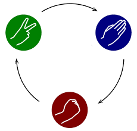
  <br>
  <em>Regras do Jogo: Pedra quebra Tesoura, Tesoura corta Papel, Papel embrulha Pedra.</em>
</div>
> - O jogador deverá jogar contra o computador;
> - Utilizar a função choice da biblioteca random, para que a escolha do computador (pedra, papel ou tesoura) seja feita de forma aleatória;
> - As entradas solicitadas ao jogador deverão ser testadas, caso ele as digite de forma errada. Informar ao jogador que ele digitou errado e solicitar novamente os dados se errados;
> - Não pode haver distinção de minúsculo e maiúsculo nas entradas solicitadas ao jogador;
> - Perguntar se o jogador gostaria de jogar novamente e se sim voltar ao jogo.

#### Link do Código:
- 🔗 [`jokenpo_CTE.py`](./02_Checkpoints_Python_2_Semestre/Checkpoint_4_Jogo_Jokenpo_Automacao/jokenpo_CTE.py)

#### Resolução:
```python
import random

opcoes = ["Pedra", "Papel", "Tesoura"]
vitorias_jogador = 0
vitorias_computador = 0
empates = 0

while True:
    print("\n1 - Pedra | 2 - Papel | 3 - Tesoura | 0 - Sair")
    escolha = int(input("Sua escolha: "))
    if escolha == 0:
        break
    if escolha not in [1, 2, 3]:
        continue
        
    jogada_usuario = opcoes[escolha - 1]
    jogada_cpu = random.choice(opcoes)
    
    print(f"Você: {jogada_usuario} vs CPU: {jogada_cpu}")
    
    if jogada_usuario == jogada_cpu:
        print(">> EMPATE!")
        empates += 1
    elif (jogada_usuario == "Pedra" and jogada_cpu == "Tesoura") or \
         (jogada_usuario == "Papel" and jogada_cpu == "Pedra") or \
         (jogada_usuario == "Tesoura" and jogada_cpu == "Papel"):
        print(">> VOCÊ VENCEU!")
        vitorias_jogador += 1
    else:
        print(">> COMPUTADOR VENCEU!")
        vitorias_computador += 1

print(f"\nPlacar Final: Jogador {vitorias_jogador} x {vitorias_computador} CPU (Empates: {empates})")
```

---

### Jogo da Forca Interativo

> **Prova 6 - ECR - Guilherme Macario**
> 
> Elaborar um programa em Python que implemente o Jogo da Forca completo, controlando o número de erros (6 tentativas), revelando as letras acertadas e exibindo o histórico de palpites.

#### Link do Código:
- 🔗 [`jogo_forca_CTE.py`](./02_Checkpoints_Python_2_Semestre/Checkpoint_6_Jogo_da_Forca_Python/jogo_forca_CTE.py)

#### Resolução:
```python
palavra_secreta = "ENGENHARIA".upper()
letras_acertadas = ["_" for _ in palavra_secreta]
letras_erradas = []
tentativas_maximas = 6

while True:
    print(f"\nPalavra: {' '.join(letras_acertadas)}")
    print(f"Erros: {', '.join(letras_erradas)} (Vidas restantes: {tentativas_maximas - len(letras_erradas)})")
    
    chute = input("Letra: ").strip().upper()
    if len(chute) != 1 or not chute.isalpha() or chute in letras_acertadas or chute in letras_erradas:
        continue
        
    if chute in palavra_secreta:
        for idx, letra in enumerate(palavra_secreta):
            if letra == chute:
                letras_acertadas[idx] = chute
    else:
        letras_erradas.append(chute)
        
    if "_" not in letras_acertadas:
        print(f"\nPARABÉNS! Palavra: {palavra_secreta}")
        break
    if len(letras_erradas) >= tentativas_maximas:
        print(f"\nGAME OVER! A palavra era: {palavra_secreta}")
        break
```

---

### 🤖 Matéria: Automação e Microcontroladores Arduino (6 Provas em C / C++)

<a id="prova-1--índice-de-risco-de-ataques-terroristas-bin-laden"></a>
### Prova 1 — Índice de Risco de Ataques Terroristas (Bin Laden)

> **Prova 1 - ECR - Guilherme Macario**  
> **Aluno: Guilherme Macario da Silva — RM: 84053**  
> 
> A morte de Osama bin Laden ocorreu durante a Operação Lança de Neptuno. Nesse dia, o governo norte-americano informou em conferência oficial que bin Laden havia sido capturado e morto por forças de operações especiais. Nesse dia, o então presidente dos Estados Unidos, Barack Obama, informou em conferência à imprensa que bin Laden havia morrido na cidade paquistanesa de Abbottabad. Segundo a versão oficial, Osama teria sido capturado e morto em um esconderijo nos arredores da cidade por forças da Joint Special Operations Command em conjunção com a CIA. Essa ocorrência deu um respiro ao perigo eminente de ataques terroristas e o mundo ocidental pode respirar um pouco mais aliviado. Foi tão importante que alterou a forma de calcular o índice que indica o quão susceptível está uma nação em relação ao terrorismo.
> 
> Até e durante o mês 5 de 2011, o índice de eminência de novos ataques era calculado, pelas agências de espionagem, através da soma da raiz quadrada do ano com o cubo do mês. Após o mês 5 de 2011, o índice de eminência de novos ataques passou a ser calculado pela subtração da metade do valor do ano pelo quadrado do mês.
> 
> Elabore um programa, em linguagem C para Arduino, que receba um ano (valor com 4 dígitos) e um mês (valor com 2 dígitos) do usuário, componha essas informações em variáveis únicas, uma para o ano e outra para o mês, e retorne o índice de eminência de novos ataques, de acordo com os padrões de cálculo apresentados no parágrafo anterior.  
> *(Dica constante na folha original da avaliação: `sqrt(valor)`)*

#### Link do Código:
- 🔗 [`prova_bin_laden_CTE.ino`](./03_Automacao_Microcontroladores_Arduino/Prova_01_Indice_Ataques_Bin_Laden/prova_bin_laden_CTE.ino)

#### Resolução:
```cpp
// Prova Prática Arduino C: Cálculo do Índice de Eminência de Novos Ataques Terroristas
// Disciplina: Computational Thinking for Engineering (CTE)
// Autor: Guilherme Macario da Silva
// Descrição: Recebe ano (4 dígitos) e mês (2 dígitos) via Serial e calcula o índice de risco.

#include <math.h>

void setup() {
  Serial.begin(9600);
  while (!Serial);
  Serial.println("==================================================");
  Serial.println("SISTEMA DE CALCULO DE RISCO DE ATAQUES TERRORISTAS");
  Serial.println("==================================================");
}

void loop() {
  int ano = 0;
  int mes = 0;
  float indice = 0.0;

  Serial.println("\nDigite o ANO (4 digitos, ex: 2011): ");
  while (Serial.available() == 0);
  ano = Serial.parseInt();

  Serial.println("Digite o MES (1 a 12, ex: 05): ");
  while (Serial.available() == 0);
  mes = Serial.parseInt();

  Serial.print("Data informada: ");
  if (mes < 10) Serial.print("0");
  Serial.print(mes);
  Serial.print("/");
  Serial.println(ano);

  // Regra de Negócio da Avaliação:
  // Até e durante maio/2011 (mes <= 5 e ano <= 2011): Indice = sqrt(ano) + mes^3
  // Após maio/2011: Indice = (ano / 2.0) - mes^2
  if (ano < 2011 || (ano == 2011 && mes <= 5)) {
    indice = sqrt((float)ano) + pow((float)mes, 3);
    Serial.println("Criterio: Ate maio/2011 -> sqrt(ano) + mes^3");
  } else {
    indice = (ano / 2.0) - pow((float)mes, 2);
    Serial.println("Criterio: Apos maio/2011 -> (ano / 2) - mes^2");
  }

  Serial.print("Indice de Eminencia de Novos Ataques: ");
  Serial.println(indice, 2);
  Serial.println("--------------------------------------------------");
  delay(2000);
}
```

---

<a id="prova-2--sinalizador-luminoso-de-ambulância-samu"></a>
### Prova 2 — Sinalizador Luminoso de Ambulância SAMU

> **Prova 2 - ECR - Guilherme Macario**  
> **Aluno: Guilherme Macario da Silva — RM: 84053**  
> 
> A superintendência do SAMU está montando um edital para compra de novas ambulâncias. Deseja acrescentar modernos sinalizadores com LEDs, compostos de controle eletrônico e diversas formas de acender e piscar. Mas possui dúvidas em relação à sua viabilidade técnica. Então decidiu te chamar para fazer a comprovação de viabilidade em um protótipo. Como você não é de perder oportunidades, logo aceitou e agora precisa montar um circuito e desenvolver um programa em linguagem C para Arduino que atenda aos requisitos do edital, que são os seguintes:
> - A viatura possui 5 LEDs e 3 chaves de acionamento.
> - As chaves ficam no painel da viatura.
> - Os LEDs ficam dispostos na parte externa da viatura.
> - A chave 2 possui 2 posições: ON e OFF. Quando ON, liga os LEDs 4 e 5, fazendo-os piscar em intervalos de 2 segundos. Quando OFF, esses LEDs apagam.
> - Os LEDs 4 e 5 são complementares. Quando LED 4 está aceso, o LED 5 deve estar apagado. E vice-versa.
> - A chave 3 possui 2 posições: ON e OFF. Quando em ON, liga o LED 1 e desliga o LED 2. Quando em OFF, liga o LED 2 e desliga o LED 1.
> - Quando ligado, o LED 2 deve ter acendimento contínuo.
> - Quando ligado, o LED 1 deve ficar aceso durante 1 segundo e apagado durante 2 segundos, periodicamente.
> - A chave 1 possui 2 posições: ON e OFF. Quando em ON, desabilita as funções das chaves 2 e 3, ao mesmo tempo em que deve acender continuamente o LED 3, e apagar os demais LEDs. Quando em OFF, libera as funções das chaves 2 e 3, e apaga o LED 3.
> 
> **Pinagem:**
> - Chave 1 - pino 8; Chave 2 - pino 9; Chave 3 - pino 10
> - LED 1-pino 3; LED 2-pino 4; LED 3-pino 5; LED 4-pino 6; LED 5-pino 7
> - Chaves: ON - ligada ao positivo; OFF - ligada a terra

#### Link do Código:
- 🔗 [`prova_samu_CTE.ino`](./03_Automacao_Microcontroladores_Arduino/Prova_02_Sinalizador_Ambulancia_SAMU/prova_samu_CTE.ino)

#### Resolução:
```cpp
// Prova Prática Arduino C: Sinalizador Luminoso de Ambulância SAMU
// Disciplina: Computational Thinking for Engineering (CTE)
// Autor: Guilherme Macario da Silva
// Descrição: Controle eletrônico de viatura de socorro com 5 LEDs e 3 chaves seletoras de prioridade.

// Definição de Pinos das Chaves
const int CH1 = 8;   // Chave 1 (Prioridade Máxima de Emergência)
const int CH2 = 9;   // Chave 2 (Sinalizador Estroboscópico LEDs 4 e 5)
const int CH3 = 10;  // Chave 3 (Sinalizador de Posição LED 1 e LED 2)

// Definição de Pinos dos LEDs
const int LED1 = 3;  // LED 1 (Pisca 1s aceso / 2s apagado quando CH3 = ON)
const int LED2 = 4;  // LED 2 (Aceso contínuo quando CH3 = OFF)
const int LED3 = 5;  // LED 3 (Prioridade de Emergência: Aceso contínuo quando CH1 = ON)
const int LED4 = 6;  // LED 4 (Pisca complementar 2s com LED 5 quando CH2 = ON)
const int LED5 = 7;  // LED 5 (Pisca complementar 2s com LED 4 quando CH2 = ON)

void setup() {
  pinMode(CH1, INPUT);
  pinMode(CH2, INPUT);
  pinMode(CH3, INPUT);

  pinMode(LED1, OUTPUT);
  pinMode(LED2, OUTPUT);
  pinMode(LED3, OUTPUT);
  pinMode(LED4, OUTPUT);
  pinMode(LED5, OUTPUT);
}

void loop() {
  int estadoCh1 = digitalRead(CH1);
  int estadoCh2 = digitalRead(CH2);
  int estadoCh3 = digitalRead(CH3);

  // CHAVE 1 (Prioridade Máxima):
  // Quando em ON: Desabilita chaves 2 e 3, acende continuamente LED 3 e apaga os demais LEDs.
  if (estadoCh1 == HIGH) {
    digitalWrite(LED3, HIGH);
    digitalWrite(LED1, LOW);
    digitalWrite(LED2, LOW);
    digitalWrite(LED4, LOW);
    digitalWrite(LED5, LOW);
  } else {
    // Quando em OFF: Libera as funções das chaves 2 e 3, e apaga o LED 3.
    digitalWrite(LED3, LOW);

    // Controle da Chave 2 (LEDs 4 e 5 complementares em intervalos de 2 segundos)
    if (estadoCh2 == HIGH) {
      digitalWrite(LED4, HIGH);
      digitalWrite(LED5, LOW);
      delay(2000);
      digitalWrite(LED4, LOW);
      digitalWrite(LED5, HIGH);
      delay(2000);
    } else {
      digitalWrite(LED4, LOW);
      digitalWrite(LED5, LOW);
    }

    // Controle da Chave 3:
    // ON  -> Liga LED 1 (1s aceso / 2s apagado periodicamente) e desliga LED 2
    // OFF -> Liga LED 2 com acendimento contínuo e desliga LED 1
    if (estadoCh3 == HIGH) {
      digitalWrite(LED2, LOW);
      digitalWrite(LED1, HIGH);
      delay(1000);
      digitalWrite(LED1, LOW);
      delay(2000);
    } else {
      digitalWrite(LED1, LOW);
      digitalWrite(LED2, HIGH);
    }
  }
}
```

---

### Prova 3 — Automação de Esteira Industrial com Aquecimento e Resfriamento

> **Prova 3 - ECR - Guilherme Macario**  
> Na esteira industrial a peça é colocada na posição dada pelo sensor S1, acionando o motor M1 até o sistema de aquecimento S2 (onde para por 3 segundos). Em seguida, o motor M1 é ligado novamente para conduzir a peça ao resfriamento S3 (aguardando 4 segundos neste estágio). Decorrido este tempo, o motor M1 é acionado para levar a peça até o sensor de saída S4, quando o motor é desligado.
> 
> **Considerações Técnicas:**
> - Sensores S1, S2, S3 e S4 simulados com Pushbuttons (pull-up).
> - Atuador M1: Motor DC da esteira.

<div align="center">
  
  <br>
  <em>Figura 1: Diagrama esquemático oficial da esteira industrial com zonas térmicas e sensores S1 a S4.</em>
</div>

#### Link do Código:
- 🔗 [`esteira_termica_CTE.ino`](./03_Automacao_Microcontroladores_Arduino/Prova_03_Esteira_Aquecimento_Resfriamento/esteira_termica_CTE.ino) • 🐍 [`esteira_termica.py`](./04_Sistemas_Embarcados_Raspberry_Pi_GPIO/Projeto_01_Esteira_Aquecimento_Resfriamento/esteira_termica.py)

#### Resolução (Arduino C++):
```cpp
const int PIN_S1 = 2;
const int PIN_S2 = 3;
const int PIN_S3 = 4;
const int PIN_S4 = 5;
const int PIN_M1 = 8;

void setup() {
  pinMode(PIN_S1, INPUT_PULLUP);
  pinMode(PIN_S2, INPUT_PULLUP);
  pinMode(PIN_S3, INPUT_PULLUP);
  pinMode(PIN_S4, INPUT_PULLUP);
  pinMode(PIN_M1, OUTPUT);
  digitalWrite(PIN_M1, LOW);
}

void aguardar(int pin) {
  while (digitalRead(pin) == HIGH) { delay(20); }
}

void loop() {
  aguardar(PIN_S1);
  digitalWrite(PIN_M1, HIGH);
  aguardar(PIN_S2);
  digitalWrite(PIN_M1, LOW);
  delay(3000);
  digitalWrite(PIN_M1, HIGH);
  aguardar(PIN_S3);
  digitalWrite(PIN_M1, LOW);
  delay(4000);
  digitalWrite(PIN_M1, HIGH);
  aguardar(PIN_S4);
  digitalWrite(PIN_M1, LOW);
}
```

---

### Prova 4 — Contador de Peças Industriais com Alerta de Lotação de Caixa

> **Prova 4 - ECR - Guilherme Macario**  
> No sistema automatizado, quando uma peça é colocada na posição do sensor S1, o motor M1 é ligado levando a peça até o sensor S2 para descarte na caixa coletora de saída. A caixa suporta até 20 peças. Ao atingir 20 peças, o motor M1 é imediatamente desligado e a lâmpada/LED L1 é acionada, alertando o operador da fábrica para substituição da caixa.
> 
> **Considerações Técnicas:**
> - Sensores S1 e S2 simulados com Pushbuttons.
> - Sinalizador L1: LED/Lâmpada de alerta.
> - Atuador M1: Motor DC da esteira.

<div align="center">
  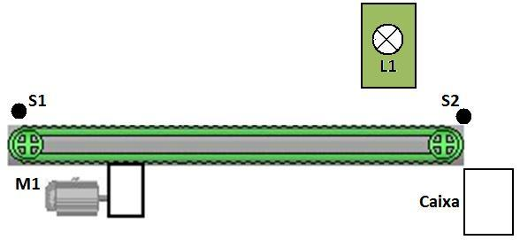
  <br>
  <em>Figura 2: Diagrama esquemático da esteira com caixa de saída e lâmpada de alerta L1.</em>
</div>

#### Link do Código:
- 🔗 [`contador_pecas_CTE.ino`](./03_Automacao_Microcontroladores_Arduino/Prova_04_Contador_Pecas_Lotacao_Caixa/contador_pecas_CTE.ino) • 🐍 [`contador_pecas.py`](./04_Sistemas_Embarcados_Raspberry_Pi_GPIO/Projeto_02_Contador_Pecas_Alerta_Caixa/contador_pecas.py)

#### Resolução (Arduino C++):
```cpp
const int PIN_S1 = 2;
const int PIN_S2 = 3;
const int PIN_M1 = 8;
const int PIN_L1 = 9;

int totalPecas = 0;

void setup() {
  pinMode(PIN_S1, INPUT_PULLUP);
  pinMode(PIN_S2, INPUT_PULLUP);
  pinMode(PIN_M1, OUTPUT);
  pinMode(PIN_L1, OUTPUT);
  digitalWrite(PIN_M1, LOW);
  digitalWrite(PIN_L1, LOW);
}

void loop() {
  if (totalPecas < 20) {
    if (digitalRead(PIN_S1) == LOW) {
      digitalWrite(PIN_M1, HIGH);
      while (digitalRead(PIN_S2) == HIGH) { delay(20); }
      totalPecas++;
      delay(200);
      if (totalPecas >= 20) {
        digitalWrite(PIN_M1, LOW);
        digitalWrite(PIN_L1, HIGH);
      }
    }
  }
}
```

---

### Prova 5 — Painel de Operador com Botão de Reset e Reinício de Ciclo

> **Prova 5 - ECR - Guilherme Macario**  
> Acrescentar ao sistema de esteira o botão B1 no painel do operador para que, após a substituição da caixa cheia, o operador aperte o botão B1 para desligar a lâmpada L1. Neste momento, o contador de peças é zerado e o ciclo operacional se reinicia automaticamente.
> 
> **Considerações Técnicas:**
> - Botão B1 de comando industrial (Pushbutton com debounce).

<div align="center">
  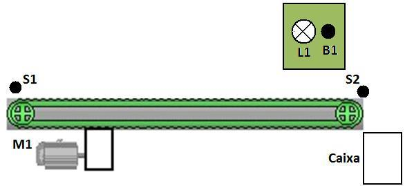
  <br>
  <em>Figura 3: Painel de controle do operador com botão B1 e lâmpada sinalizadora L1.</em>
</div>

#### Link do Código:
- 🔗 [`painel_reset_CTE.ino`](./03_Automacao_Microcontroladores_Arduino/Prova_05_Painel_Reset_Ciclo_Producao/painel_reset_CTE.ino) • 🐍 [`painel_reset.py`](./04_Sistemas_Embarcados_Raspberry_Pi_GPIO/Projeto_03_Painel_Reset_Ciclo_Producao/painel_reset.py)

#### Resolução (Arduino C++):
```cpp
const int PIN_S1 = 2;
const int PIN_S2 = 3;
const int PIN_B1 = 4;
const int PIN_M1 = 8;
const int PIN_L1 = 9;

int contadorPecas = 0;

void setup() {
  pinMode(PIN_S1, INPUT_PULLUP);
  pinMode(PIN_S2, INPUT_PULLUP);
  pinMode(PIN_B1, INPUT_PULLUP);
  pinMode(PIN_M1, OUTPUT);
  pinMode(PIN_L1, OUTPUT);
  digitalWrite(PIN_M1, LOW);
  digitalWrite(PIN_L1, LOW);
}

void loop() {
  if (contadorPecas < 20) {
    if (digitalRead(PIN_S1) == LOW) {
      digitalWrite(PIN_M1, HIGH);
      while (digitalRead(PIN_S2) == HIGH) { delay(20); }
      contadorPecas++;
      delay(200);
      if (contadorPecas >= 20) {
        digitalWrite(PIN_M1, LOW);
        digitalWrite(PIN_L1, HIGH);
      }
    }
  } else {
    if (digitalRead(PIN_B1) == LOW) {
      delay(50);
      if (digitalRead(PIN_B1) == LOW) {
        contadorPecas = 0;
        digitalWrite(PIN_L1, LOW);
        while (digitalRead(PIN_B1) == LOW);
      }
    }
  }
}
```

---

### Prova 6 — Classificador Ótico de Caixas por Altura com Sensores Múltiplos

> **Prova 6 - ECR - Guilherme Macario**  
> Sistema de triagem automática e seleção por altura de caixas em esteira industrial. Quando uma caixa é inserida no sensor S1, o motor M1 é ligado conduzindo a caixa até o sensor de descarregamento S5. Conforme a altura da embalagem, detectada pelos sensores óticos verticais S2, S3 e S4, aciona-se exclusivamente o sinalizador luminoso correspondente (L1 para Caixa Baixa, L2 para Caixa Média, L3 para Caixa Alta), permanecendo aceso até a chegada ao sensor final S5.
> 
> **Considerações Técnicas:**
> - Sensores S1 a S5 simulados com entradas digitais.
> - Sinalizadores L1, L2 e L3: LEDs indicativos de categoria.
> - Atuador M1: Motor DC da esteira.

<div align="center">
  
  <br>
  <em>Figura 4: Triagem ótica de caixas por altura com matriz de sensores S2, S3, S4 e sinalizadores L1, L2, L3.</em>
</div>

#### Link do Código:
- 🔗 [`classificador_caixas_CTE.ino`](./03_Automacao_Microcontroladores_Arduino/Prova_06_Classificador_Otico_Caixas/classificador_caixas_CTE.ino) • 🐍 [`classificador_caixas.py`](./04_Sistemas_Embarcados_Raspberry_Pi_GPIO/Projeto_04_Classificador_Caixas_Sensores/classificador_caixas.py)

#### Resolução (Arduino C++):
```cpp
const int PIN_S1 = 2, PIN_S2 = 3, PIN_S3 = 4, PIN_S4 = 5, PIN_S5 = 6;
const int PIN_M1 = 8, PIN_L1 = 9, PIN_L2 = 10, PIN_L3 = 11;

void setup() {
  pinMode(PIN_S1, INPUT_PULLUP);
  pinMode(PIN_S2, INPUT_PULLUP);
  pinMode(PIN_S3, INPUT_PULLUP);
  pinMode(PIN_S4, INPUT_PULLUP);
  pinMode(PIN_S5, INPUT_PULLUP);
  pinMode(PIN_M1, OUTPUT);
  pinMode(PIN_L1, OUTPUT);
  pinMode(PIN_L2, OUTPUT);
  pinMode(PIN_L3, OUTPUT);
  digitalWrite(PIN_M1, LOW);
}

void apagarLEDs() {
  digitalWrite(PIN_L1, LOW);
  digitalWrite(PIN_L2, LOW);
  digitalWrite(PIN_L3, LOW);
}

void loop() {
  apagarLEDs();
  while (digitalRead(PIN_S1) == HIGH) { delay(20); }
  digitalWrite(PIN_M1, HIGH);
  delay(100);
  
  if (digitalRead(PIN_S4) == LOW) {
    digitalWrite(PIN_L3, HIGH);
  } else if (digitalRead(PIN_S3) == LOW) {
    digitalWrite(PIN_L2, HIGH);
  } else {
    digitalWrite(PIN_L1, HIGH);
  }
  
  while (digitalRead(PIN_S5) == HIGH) { delay(20); }
  digitalWrite(PIN_M1, LOW);
  apagarLEDs();
}
```

---

---

## 3. Sprints de Engenharia (Challenge Hospital Alemão Oswaldo Cruz)

> **Projeto Integrado de Inovação em Saúde:** Exoesqueleto Ativo de Membro Superior com Interface Cérebro-Máquina (BMI/BCI)  
> **Parceiro Institucional:** Hospital Alemão Oswaldo Cruz (HAOC) • Engenharia Biomédica e IoT  
> **Fase:** Consolidação Final (Sprints 1, 2, 3 e 4) • **Status:** Ciclo Anual Aprovado e Validado ✅  
> **Documentação Técnica Oficial:** [📄 Relatório Técnico Integrado HAOC (PDF)](./07_Sprints_Challenge_Hospital_Oswaldo_Cruz/docs/Relatório%20Técnico%20Integrado%20-%20Exoesqueleto%20BCI%20HAOC.pdf) • [📚 Referência Internacional Industrie 4.0 IoT (PDF)](./07_Sprints_Challenge_Hospital_Oswaldo_Cruz/docs/Exoskeletons%20Towards%20Industrie%204.0%20Benefits%20and%20Challenges%20of%20the%20IoT.pdf)

<a id="sprint-1--proposta-do-challenge-hardware-software-e-cronograma"></a>
### Sprint 1 — Proposta do Challenge, Hardware, Software e Cronograma

> **1. Ideia Consolidada e Objetivo Clínico**  
> Desenvolver um exoesqueleto robótico de membro superior assistido por Interface Cérebro-Máquina (BMI/BCI) não invasiva, microcontrolado via ESP32, visando a neurorreabilitação motora ativa de pacientes pós-Acidente Vascular Cerebral (AVC) e portadores de lesões neuromusculares no Hospital Alemão Oswaldo Cruz.
> 
> A recuperação funcional tradicional sofre com a dissociação temporal entre a intenção voluntária do paciente e a resposta mecânica do membro paralisado. Ao capturar os ritmos sensoriomotores (ondas Mu e Beta no córtex motor) momentos antes da execução, o exoesqueleto atua em regime de *assist-as-needed* (assistência sob demanda), potencializando a neuroplasticidade e estimulando o remapeamento cortical sináptico.
> 
> - **Latência Média de Resposta:** `< 380 ms` (do limiar de intenção neural ao avanço inicial do torque motriz).
> - **Precisão Angular no Membro:** `± 0,45°` (garantida pelo microstepping 1/16 do motor de passo com redutor).
> - **Velocidade Angular Segura:** `25°/s` (parâmetro fisioterapêutico para proteção articular).
> - **Torque Máximo Operacional:** `4,8 N·m` (torque dinâmico na junta do cotovelo).

#### Link do Documento:
- 🔗 [`Enunciado_Sprint_1_CTE.md`](./07_Sprints_Challenge_Hospital_Oswaldo_Cruz/Sprint_1/Enunciado_Sprint_1_CTE.md)

---

<a id="sprint-2--ideia-consolidada-arquitetura-e-diagrama-de-sistema"></a>
### Sprint 2 — Ideia Consolidada, Arquitetura e Diagrama de Sistema

> **2. Diagrama de Arquitetura do Sistema (*Closed-Loop*)**  
> A arquitetura opera em malha fechada (*closed-loop*), dividida em quatro camadas funcionais interconectadas:

```mermaid
graph TD
    subgraph 1. Camada Neural (BCI)
        E[Eletrodos Córtex Motor C3/Cz/C4] --> F[Filtro Notch 60Hz + Bandpass 8-30Hz]
        F --> EXT[Extração de Ondas Mu e Beta]
        EXT --> S1[Saída: UART / BLE Intenção]
    end

    subgraph 2. Unidade Central (ESP32)
        S1 --> FSM[FSM de Controle de Estado e Segurança]
        FSM --> STEP[Geração de Pulsos STEP / DIR]
        ENC[Encoders AS5600 + Fim-de-Curso] --> FSM
    end

    subgraph 3. Potência Mecânica
        STEP --> DRV[Driver Silencioso TMC2208]
        DRV --> MOT[Motor de Passo NEMA 23]
        MOT --> RED[Redução Epicicloidal 1:10]
        RED --> ORT[Órtese / Junta Articular (4.8 N·m)]
    end

    subgraph 4. Telemetria Médica
        FSM --> GTW[Gateway Wi-Fi HTTPS / TLS 1.3]
        GTW --> JSON[Formato HL7 / FHIR JSON]
        JSON --> DASH[Dashboard Fisioterapeuta HAOC]
        DASH --> PRONT[Prontuário Oswaldo Cruz]
    end
```

> **Segurança Intrínseca:** O firmware monitora interruptores mecânicos e limite de corrente em tempo real. Qualquer desacoplamento do eletrodo ou desvio de trajetória corta imediatamente a alimentação dos enrolamentos (*E-Stop* por hardware).

#### Link do Documento:
- 🔗 [`Enunciado_Sprint_2_CTE.md`](./07_Sprints_Challenge_Hospital_Oswaldo_Cruz/Sprint_2/Enunciado_Sprint_2_CTE.md)

---

<a id="sprint-3--custo-de-desenvolvimento-e-protótipo-de-engenharia"></a>
### Sprint 3 — Custo de Desenvolvimento e Protótipo de Engenharia

> **3. Engenharia, Dimensionamento Orçamentário e Custos (BOM)**  
> **Status:** APROVADO SPRINT 3 CTE ✅  
> 
> **Especificação de Hardware:**
> - **Módulo de Processamento (MCU):** ESP32 WROOM-32D Dual-Core com co-processador ULP dedicado ao debounce e leitura analógica.
> - **Interface Neural (BMI):** Front-end biopotencial com eletrodos secos em C3/Cz/C4 (sistema 10-20), conversão analógica de 24 bits e CMRR > 110 dB.
> - **Atuação e Cinomática:** Motor de Passo NEMA 23 (18 kgf·cm) associado a redutor planetário 1:10 (torque 4,8 N·m).
> - **Driver Silencioso:** Trinamic TMC2208 com tecnologia StealthChop2, eliminando ruídos acústicos.

| Item / Componente | Modelo / Especificação | Qtd. | Unitário (R$) | Total (R$) |
| :--- | :--- | :---: | :---: | :---: |
| **Microcontrolador Principal** | ESP32 NodeMCU 30 Pinos | 2 un | R$ 48,00 | R$ 96,00 |
| **Headset Neural / Módulo EEG** | Kit Front-End Biopotencial BCI | 1 un | R$ 890,00 | R$ 890,00 |
| **Atuador Eletromecânico** | Motor de Passo NEMA 23 + Redutor 1:10 | 1 un | R$ 380,00 | R$ 380,00 |
| **Módulo Driver de Potência** | TMC2208 SilentStepStick | 2 un | R$ 42,00 | R$ 84,00 |
| **Estrutura Exoesquelética 3D** | Filamento PETG / Fibra de Carbono | 1 kg | R$ 180,00 | R$ 180,00 |
| **Encoders e Finais de Curso** | AS5600 Magnético + Microswitches | 1 kit | R$ 75,00 | R$ 75,00 |
| **Fonte Chaveada e Proteções** | 24V 5A Industrial c/ Optoacopladores | 1 un | R$ 135,00 | R$ 135,00 |
| <strong colspan="4">CUSTO TOTAL DE MATERIAIS (PROTÓTIPO FUNCIONAL):</strong> | | | | **R$ 1.840,00** |

> **Firmware Embarcado e Telemetria (Build v2.4-STABLE):**
> Implementação em C/C++ FreeRTOS com interrupção de emergência IRAM_ATTR e despacho de relatório estruturado em JSON com conformidade LGPD e criptografia TLS 1.3 ponta a ponta.

#### Link do Documento:
- 🔗 [`Enunciado_Sprint_3_CTE.md`](./07_Sprints_Challenge_Hospital_Oswaldo_Cruz/Sprint_3/Enunciado_Sprint_3_CTE.md)

---

<a id="sprint-4--relatório-final-integrado-e-conclusão"></a>
### Sprint 4 — Relatório Final Integrado e Conclusão

> **4. Cronograma Anual Consolidado e Conclusão Executiva**  
> **Status:** CICLO ANUAL COMPLETO VALIDADO ✅

| Bimestre / Mês | Etapa do Projeto | Atividades e Marcos Técnicos | Status |
| :---: | :--- | :--- | :---: |
| **Mês 01 – 02** | **Sprint 1: Requisitos & Concepção** | Levantamento com equipe do Oswaldo Cruz, definição de graus de liberdade e segurança articular. | **Concluído** ✅ |
| **Mês 03 – 04** | **Sprint 2: Arquitetura & Bancada** | Modelagem CAD da órtese, testes elétricos do ESP32 com motor NEMA e validação da recepção serial BCI. | **Concluído** ✅ |
| **Mês 05 – 06** | **Sprint 3: Custos & Protótipo** | Cotação de componentes (BOM), montagem da PCB modular e ensaios de torque sob carga controlada. | **Concluído** ✅ |
| **Mês 07 – 08** | **Sprint 4: Integração & Telemetria** | Geração dos relatórios em JSON, homologação de testes com parada de emergência e documentação final. | **Concluído** ✅ |
| **Mês 09 – 10** | **Homologação Hospitalar** | Ensaios simulados com equipe de fisioterapia em ambiente controlado no HAOC. | *Em Planejamento* ⏳ |
| **Mês 11 – 12** | **Piloto Clínico & Artigo** | Coleta de dados de eficácia terapêutica e submissão de relatório para o comitê de ética. | *Projetado* 🎯 |

> **Conclusão Executiva:**
> - **Custo-Benefício Excepcional:** Custo total de hardware de bancada (R$ 1.840,00) substancialmente mais acessível que alternativas comerciais importadas.
> - **Eficiência Terapêutica:** Acoplamento do limiar de intenção neural com movimento mecânico imediato atende às diretrizes de reeducação neurofuncional do Hospital Oswaldo Cruz.
> - **Integração Médica Direta:** Emissão automatizada do relatório para a nuvem desonera a equipe médica de anotações manuais.
> - **Assinatura Técnica do Projeto:** Documento técnico compilado para avaliação da banca examinadora da FIAP e supervisão médica do Hospital Alemão Oswaldo Cruz.

#### Links e Documentos Oficiais:
- 🔗 Enunciado e Código: [`Enunciado_Sprint_4_CTE.md`](./07_Sprints_Challenge_Hospital_Oswaldo_Cruz/Sprint_4/Enunciado_Sprint_4_CTE.md)
- 📄 Relatório Técnico Integrado (PDF HAOC): [`Relatório Técnico Integrado - Exoesqueleto BCI HAOC.pdf`](./07_Sprints_Challenge_Hospital_Oswaldo_Cruz/docs/Relatório%20Técnico%20Integrado%20-%20Exoesqueleto%20BCI%20HAOC.pdf)
- 📚 Artigo Científico (ScienceDirect / Elsevier): [*Exoskeletons Towards Industrie 4.0: Benefits and Challenges of the IoT*](./07_Sprints_Challenge_Hospital_Oswaldo_Cruz/docs/Exoskeletons%20Towards%20Industrie%204.0%20Benefits%20and%20Challenges%20of%20the%20IoT.pdf)
---

## 4. Exercícios Práticos de Laboratório

### 🐍 Matéria: Programação em Python

<a id="1-estruturas-sequenciais-variáveis-e-operações-aritméticas"></a>
#### Módulo 1: Estruturas Sequenciais, Variáveis e Operações Aritméticas

### Identificação do Estudante e RM

> Faça um programa que mostre seu nome completo na tela e seu RM da FIAP.
> 
> **Exemplo de Entrada:**
> `Nome: Guilherme Macario da Silva`  
> `RM: 84053`  
> 
> **Exemplo de Saída:**
> `Nome: Guilherme Macario da Silva`  
> `RM: 84053`

#### Link do Código:
- 🔗 [`questao1_CTE.py`](./01_Checkpoints_Python_1_Semestre/Checkpoint_1_Sistemas_Tarifas_Energia_Combustivel/questao1_CTE.py)

#### Resolução:
```python
nome = input("Digite seu nome completo: ")
rm = input("Digite seu RM: ")

print(f"Nome: {nome}")
print(f"RM: {rm}")
```

---

### Conversor de Temperaturas Celsius e Fahrenheit

> Com função, crie um programa de conversão entre as temperaturas Celsius e Farenheit. Primeiro o usuário deve escolher se vai entrar com a temperatura em Célsius ou Farenheit, depois a conversão escolhida é realizada através de comandos IF. Se C é a temperatura em Célsius e F em Farenheit, as fórmulas de conversão são: C = 5*(F-32)/9 e F = (9*C/5) + 32.

#### Link do Código:
- 🔗 [`exercicio_11.py`](./05_Lista_Padrao_40_Exercicios_Python/exercicio_11.py)

#### Resolução:
```python
def celsius_para_fahrenheit(c):
    return (9 * c / 5) + 32

def fahrenheit_para_celsius(f):
    return 5 * (f - 32) / 9

print("=== CONVERSOR DE TEMPERATURA ===")
print("1 - Celsius para Fahrenheit")
print("2 - Fahrenheit para Celsius")
op = input("Escolha a opção (1 ou 2): ")

if op == '1':
    c = float(input("Digite a temperatura em ºC: "))
    print(f"{c} ºC = {celsius_para_fahrenheit(c):.2f} ºF")
elif op == '2':
    f = float(input("Digite a temperatura em ºF: "))
    print(f"{f} ºF = {fahrenheit_para_celsius(f):.2f} ºC")
else:
    print("Opção inválida.")
```

---

### Cálculo do Volume de uma Esfera

> Elabore um programa em Python com uma função que recebe o raio de uma esfera e calcula o seu volume ($v = rac{4}{3}\pi R^3$).

#### Link do Código:
- 🔗 [`exercicio_17.py`](./05_Lista_Padrao_40_Exercicios_Python/exercicio_17.py)

#### Resolução:
```python
import math

def volume_esfera(raio):
    return (4.0 / 3.0) * math.pi * (raio ** 3)

r = float(input("Digite o raio da esfera: "))
print(f"O volume da esfera de raio {r} é: {volume_esfera(r):.4f}")
```

---

### Conversão de Tempo para Segundos

> Elabore um programa em Python com uma função que recebe o tempo de duração de um vídeo expresso em horas, minutos e segundos e retorna esse tempo em segundos.

#### Link do Código:
- 🔗 [`exercicio_21.py`](./05_Lista_Padrao_40_Exercicios_Python/exercicio_21.py)

#### Resolução:
```python
def converter_para_segundos(horas, minutos, segundos):
    return (horas * 3600) + (minutos * 60) + segundos

h = int(input("Horas: "))
m = int(input("Minutos: "))
s = int(input("Segundos: "))
print(f"Tempo total em segundos: {converter_para_segundos(h, m, s)} segundos")
```

---

### Conversão de Idade em Dias

> Elabore um programa em Python com uma função que recebe a idade de uma pessoa em anos, meses e dias e retorna essa idade expressa em dias.

#### Link do Código:
- 🔗 [`exercicio_22.py`](./05_Lista_Padrao_40_Exercicios_Python/exercicio_22.py)

#### Resolução:
```python
def idade_em_dias(anos, meses, dias):
    return (anos * 365) + (meses * 30) + dias

a = int(input("Anos: "))
m = int(input("Meses: "))
d = int(input("Dias: "))
print(f"Idade total expressa em dias: {idade_em_dias(a, m, d)} dias")
```

---

### Cálculo do Peso Ideal por Altura e Sexo

> Elabore um programa em Python com uma função que recebe a altura (alt) e o sexo de uma pessoa e retorna o seu peso ideal. Para homens: $72.7 	imes 	ext{alt} - 58$. Para mulheres: $62.1 	imes 	ext{alt} - 44.7$.

#### Link do Código:
- 🔗 [`exercicio_28.py`](./05_Lista_Padrao_40_Exercicios_Python/exercicio_28.py)

#### Resolução:
```python
def peso_ideal(altura, sexo):
    sexo = sexo.strip().upper()
    if sexo == 'M':
        return (72.7 * altura) - 58.0
    elif sexo == 'F':
        return (62.1 * altura) - 44.7
    else:
        raise ValueError("Sexo inválido. Utilize 'M' ou 'F'.")

alt = float(input("Digite a altura em metros: "))
sexo = input("Digite o sexo (M/F): ")
print(f"Peso ideal calculado: {peso_ideal(alt, sexo):.2f} kg")
```

---

<a id="2-estruturas-de-decisão-e-desvios-condicionais-if--elif--else"></a>
#### Módulo 2: Estruturas de Decisão e Desvios Condicionais (if / elif / else)

### Verificação de Número Positivo

> Crie um programa com uma função que receba um valor e informe se ele é positivo ou não.

#### Link do Código:
- 🔗 [`exercicio_01.py`](./05_Lista_Padrao_40_Exercicios_Python/exercicio_01.py)

#### Resolução:
```python
def eh_positivo(valor):
    return valor > 0

num = float(input("Digite um número: "))
print("É positivo?" if eh_positivo(num) else "Não é positivo.")
```

---

### Verificação de Número Nulo

> Crie um programa com uma função que receba um valor e diga se é nulo ou não.

#### Link do Código:
- 🔗 [`exercicio_02.py`](./05_Lista_Padrao_40_Exercicios_Python/exercicio_02.py)

#### Resolução:
```python
def eh_nulo(valor):
    return valor == 0

num = float(input("Digite um número: "))
print("É nulo (zero)." if eh_nulo(num) else "Não é nulo.")
```

---

### Maior Valor entre 2 Números

> Crie um programa com uma função em linguagem python que receba 2 números e retorne o maior valor.

#### Link do Código:
- 🔗 [`exercicio_05.py`](./05_Lista_Padrao_40_Exercicios_Python/exercicio_05.py)

#### Resolução:
```python
def maior_de_dois(n1, n2):
    return n1 if n1 > n2 else n2

a = float(input("1º número: "))
b = float(input("2º número: "))
print(f"Maior: {maior_de_dois(a, b)}")
```

---

### Menor Valor entre 2 Números

> Crie um programa com uma função em linguagem python que receba 2 números e retorne o menor valor.

#### Link do Código:
- 🔗 [`exercicio_06.py`](./05_Lista_Padrao_40_Exercicios_Python/exercicio_06.py)

#### Resolução:
```python
def menor_de_dois(n1, n2):
    return n1 if n1 < n2 else n2

a = float(input("1º número: "))
b = float(input("2º número: "))
print(f"Menor: {menor_de_dois(a, b)}")
```

---

### Maior Valor entre 3 Números

> Crie um programa com uma função em linguagem python que receba 3 números e retorne o maior valor.

#### Link do Código:
- 🔗 [`exercicio_07.py`](./05_Lista_Padrao_40_Exercicios_Python/exercicio_07.py)

#### Resolução:
```python
def maior_de_tres(a, b, c):
    maior = a
    if b > maior: maior = b
    if c > maior: maior = c
    return maior

a = float(input("a: "))
b = float(input("b: "))
c = float(input("c: "))
print(f"Maior: {maior_de_tres(a, b, c)}")
```

---

### Menor Valor entre 3 Números

> Crie um programa com uma função em linguagem python que receba 3 números e retorne o menor valor.

#### Link do Código:
- 🔗 [`exercicio_08.py`](./05_Lista_Padrao_40_Exercicios_Python/exercicio_08.py)

#### Resolução:
```python
def menor_de_tres(a, b, c):
    menor = a
    if b < menor: menor = b
    if c < menor: menor = c
    return menor

a = float(input("a: "))
b = float(input("b: "))
c = float(input("c: "))
print(f"Menor: {menor_de_tres(a, b, c)}")
```

---

### Classificação e Verificação de Triângulos

> Elabore um programa em Python com uma função que receba 3 valores reais X, Y e Z e verifique se podem formar triângulo. Identificar se é Equilátero (3 iguais), Isósceles (2 iguais) ou Escaleno (3 diferentes).

#### Link do Código:
- 🔗 [`exercicio_30.py`](./05_Lista_Padrao_40_Exercicios_Python/exercicio_30.py)

#### Resolução:
```python
def classificar_triangulo(x, y, z):
    if (x < y + z) and (y < x + z) and (z < x + y):
        if x == y == z:
            return "Triângulo Equilátero"
        elif x == y or x == z or y == z:
            return "Triângulo Isósceles"
        else:
            return "Triângulo Escaleno"
    return "Não forma triângulo"

x = float(input("X: "))
y = float(input("Y: "))
z = float(input("Z: "))
print(classificar_triangulo(x, y, z))
```

---

### Classificação de Categoria de Nadador

> Elabore um programa que receba a idade de um nadador e retorne sua categoria:
> - 5 a 7: Infantil A
> - 8 a 10: Infantil B
> - 11 a 13: Juvenil A
> - 14 a 17: Juvenil B
> - >= 18: Adulto

#### Link do Código:
- 🔗 [`exercicio_24.py`](./05_Lista_Padrao_40_Exercicios_Python/exercicio_24.py)

#### Resolução:
```python
def categoria_nadador(idade):
    if 5 <= idade <= 7: return "Infantil A"
    elif 8 <= idade <= 10: return "Infantil B"
    elif 11 <= idade <= 13: return "Juvenil A"
    elif 14 <= idade <= 17: return "Juvenil B"
    elif idade >= 18: return "Adulto"
    return "Abaixo da idade mínima permitida"

idade = int(input("Idade: "))
print(f"Categoria: {categoria_nadador(idade)}")
```

---

### Verificação Booleana Positivo ou Negativo

> Elabore uma função que recebe um valor inteiro e verifica se é positivo ou negativo, retornando booleano.

#### Link do Código:
- 🔗 [`exercicio_25.py`](./05_Lista_Padrao_40_Exercicios_Python/exercicio_25.py)

#### Resolução:
```python
def eh_positivo(num):
    return num >= 0

val = int(input("Valor: "))
print(f"É positivo? {eh_positivo(val)}")
```

---

### Verificação Booleana Par ou Ímpar

> Elabore uma função que recebe um valor inteiro e verifica se é par ou ímpar, retornando booleano.

#### Link do Código:
- 🔗 [`exercicio_26.py`](./05_Lista_Padrao_40_Exercicios_Python/exercicio_26.py)

#### Resolução:
```python
def eh_par(num):
    return num % 2 == 0

val = int(input("Valor: "))
print(f"É par? {eh_par(val)}")
```

---

### Conceito Acadêmico por Faixa de Nota

> Elabore uma função que recebe a média final e retorna o conceito:
> - 0.0 a 4.9: D
> - 5.0 a 6.9: C
> - 7.0 a 8.9: B
> - 9.0 a 10.0: A

#### Link do Código:
- 🔗 [`exercicio_27.py`](./05_Lista_Padrao_40_Exercicios_Python/exercicio_27.py)

#### Resolução:
```python
def obter_conceito(media):
    if 0.0 <= media <= 4.9: return 'D'
    elif 5.0 <= media <= 6.9: return 'C'
    elif 7.0 <= media <= 8.9: return 'B'
    elif 9.0 <= media <= 10.0: return 'A'
    return 'Nota inválida'

media = float(input("Média final: "))
print(f"Conceito: {obter_conceito(media)}")
```

---

### Duração de Jogo com Transição de Meia-Noite

> Elabore uma função que recebe a hora de início e de término de um jogo (horas e minutos) e retorna a duração total em minutos, considerando jogos de até 24 horas que podem cruzar a meia-noite.

#### Link do Código:
- 🔗 [`exercicio_29.py`](./05_Lista_Padrao_40_Exercicios_Python/exercicio_29.py)

#### Resolução:
```python
def duracao_jogo_minutos(h_ini, m_ini, h_fim, m_fim):
    inicio = (h_ini * 60) + m_ini
    fim = (h_fim * 60) + m_fim
    return fim - inicio if fim >= inicio else (24 * 60 - inicio) + fim

h1 = int(input("Hora início: "))
m1 = int(input("Minuto início: "))
h2 = int(input("Hora término: "))
m2 = int(input("Minuto término: "))
dur = duracao_jogo_minutos(h1, m1, h2, m2)
print(f"Duração: {dur} minutos ({dur // 60}h {dur % 60}min)")
```

---

<a id="3-estruturas-de-repetição-e-laços-for--while"></a>
#### Módulo 3: Estruturas de Repetição e Laços (for / while)

### Simulação de Monte Carlo: 1 Milhão de Lançamentos de Dado

> Lance o dado 1 milhão de vezes com a função `Dado()`. Conte quantas vezes cada número saiu e analise a distribuição probabilística empírica em relação à probabilidade teórica (16.67%).

#### Link do Código:
- 🔗 [`exercicio_10.py`](./05_Lista_Padrao_40_Exercicios_Python/exercicio_10.py)

#### Resolução:
```python
import random

def Dado():
    return random.randint(1, 6)

total_lancamentos = 1_000_000
contadores = {1: 0, 2: 0, 3: 0, 4: 0, 5: 0, 6: 0}

for _ in range(total_lancamentos):
    face = Dado()
    contadores[face] += 1

print("=== DISTRIBUIÇÃO DE PROBABILIDADE ===")
for face, cont in contadores.items():
    pct = (cont / total_lancamentos) * 100
    print(f"Face {face}: {cont:,} vezes ({pct:.2f}%) - Teórico: ~16.67%")
```

---

### Tabuada Dinâmica de 1 até N

> Elabore uma função que recebe um valor N e calcula e escreve a tabuada de 1 até N.

#### Link do Código:
- 🔗 [`exercicio_35.py`](./05_Lista_Padrao_40_Exercicios_Python/exercicio_35.py)

#### Resolução:
```python
def tabuada_ate_n(n):
    for i in range(1, n + 1):
        print(f"{i} x {n} = {i * n}")

n = int(input("Digite N: "))
tabuada_ate_n(n)
```

---

### Pesquisa Demográfica Municipal (Salários e Filhos)

> Pesquisa entre habitantes coletando salário e número de filhos para número indeterminado de pessoas. Retornar média de salário, média de filhos, maior salário e percentual de pessoas com salário até R$ 350,00.

#### Link do Código:
- 🔗 [`exercicio_31.py`](./05_Lista_Padrao_40_Exercicios_Python/exercicio_31.py)

#### Resolução:
```python
def pesquisar_habitantes():
    salarios, filhos = [], []
    while True:
        sal = float(input("Salário (negativo para parar): R$ "))
        if sal < 0: break
        num_f = int(input("Número de filhos: "))
        salarios.append(sal)
        filhos.append(num_f)
        
    if salarios:
        print(f"Média Salário: R$ {sum(salarios)/len(salarios):.2f}")
        print(f"Média Filhos: {sum(filhos)/len(filhos):.1f}")
        print(f"Maior Salário: R$ {max(salarios):.2f}")
        pct = (len([s for s in salarios if s <= 350])/len(salarios))*100
        print(f"Salário até R$350: {pct:.2f}%")

pesquisar_habitantes()
```

---

### Média Aritmética de Valores Positivos Indeterminados

> Leia um número não determinado de valores positivos e retorne a média aritmética deles. Finalizar ao digitar número negativo.

#### Link do Código:
- 🔗 [`exercicio_32.py`](./05_Lista_Padrao_40_Exercicios_Python/exercicio_32.py)

#### Resolução:
```python
def media_positivos():
    valores = []
    while True:
        v = float(input("Valor (negativo encerra): "))
        if v < 0: break
        valores.append(v)
    return sum(valores) / len(valores) if valores else 0.0

print(f"Média: {media_positivos():.2f}")
```

---

### Maior e Menor entre 50 Valores Inteiros

> Elabore uma função que lê 50 valores inteiros e retorna o maior e o menor deles.

#### Link do Código:
- 🔗 [`exercicio_34.py`](./05_Lista_Padrao_40_Exercicios_Python/exercicio_34.py)

#### Resolução:
```python
def maior_menor_50(valores):
    return max(valores), min(valores)

amostra = [i for i in range(1, 51)]
maior, menor = maior_menor_50(amostra)
print(f"Maior: {maior} | Menor: {menor}")
```

---

<a id="4-funções-modulares-e-algoritmos-matemáticos-def"></a>
#### Módulo 4: Funções Modulares e Algoritmos Matemáticos (def)

<a id="cálculo-do-discriminante-delta-de-equação-do-2º-grau"></a>
### Cálculo do Discriminante Δ de Equação do 2º Grau

> Crie um programa com uma função que receba três valores ('a', 'b', 'c') e retorne o valor de $\Delta$ ($b^2 - 4ac$).

#### Link do Código:
- 🔗 [`exercicio_03.py`](./05_Lista_Padrao_40_Exercicios_Python/exercicio_03.py)

#### Resolução:
```python
def calcular_delta(a, b, c):
    return (b ** 2) - (4 * a * c)

a = float(input("a: "))
b = float(input("b: "))
c = float(input("c: "))
print(f"Δ = {calcular_delta(a, b, c)}")
```

---

### Resolução da Equação do 2º Grau (Raízes Reais e Complexas)

> Crie um programa que calcula as raízes de uma equação do 2º grau ($ax^2 + bx + c = 0$). Se $\Delta \ge 0$, raízes reais; se $\Delta < 0$, raízes complexas da forma $x + iy$.

#### Link do Código:
- 🔗 [`exercicio_04.py`](./05_Lista_Padrao_40_Exercicios_Python/exercicio_04.py)

#### Resolução:
```python
import math

def resolver_equacao_2grau(a, b, c):
    if a == 0:
        print("Erro: 'a' não pode ser zero.")
        return
    delta = (b ** 2) - (4 * a * c)
    if delta >= 0:
        x1 = (-b + math.sqrt(delta)) / (2 * a)
        x2 = (-b - math.sqrt(delta)) / (2 * a)
        print(f"Raízes reais: x1 = {x1:.4f}, x2 = {x2:.4f}")
    else:
        real = -b / (2 * a)
        imag = math.sqrt(-delta) / (2 * a)
        print(f"Raízes complexas: x1 = {real:.4f} + {imag:.4f}i, x2 = {real:.4f} - {imag:.4f}i")

a = float(input("a: "))
b = float(input("b: "))
c = float(input("c: "))
resolver_equacao_2grau(a, b, c)
```

---

### Resolução da Fórmula de Bhaskara

> Elabore uma função que recebe os coeficientes da fórmula de Bhaskara e imprime as raízes caso seja possível calcular.

#### Link do Código:
- 🔗 [`exercicio_20.py`](./05_Lista_Padrao_40_Exercicios_Python/exercicio_20.py)

#### Resolução:
```python
import math

def bhaskara(a, b, c):
    if a == 0: return
    d = (b**2) - (4*a*c)
    if d >= 0:
        print(f"x1 = {(-b + math.sqrt(d))/(2*a):.4f}")
        print(f"x2 = {(-b - math.sqrt(d))/(2*a):.4f}")
    else:
        print("Sem raízes reais")

bhaskara(float(input("a: ")), float(input("b: ")), float(input("c: ")))
```

---

### Média com Descarte da Menor Nota (3 Provas)

> Função que recebe 3 notas e mostra a média com as 3 provas, a média com as 2 maiores notas, a nota mais alta e a mais baixa.

#### Link do Código:
- 🔗 [`exercicio_12.py`](./05_Lista_Padrao_40_Exercicios_Python/exercicio_12.py)

#### Resolução:
```python
def analisar_notas(n1, n2, n3):
    notas = sorted([n1, n2, n3])
    print(f"Média 3 provas: {sum(notas)/3.0:.2f}")
    print(f"Média 2 maiores: {(notas[1] + notas[2])/2.0:.2f}")
    print(f"Maior: {notas[2]} | Menor: {notas[0]}")

analisar_notas(float(input("N1: ")), float(input("N2: ")), float(input("N3: ")))
```

---

### Identificação e Listagem de Números Primos até 1000

> Elabore uma função que ache todos os números primos até 1000.

#### Link do Código:
- 🔗 [`exercicio_13.py`](./05_Lista_Padrao_40_Exercicios_Python/exercicio_13.py)

#### Resolução:
```python
def eh_primo(n):
    if n < 2: return False
    for i in range(2, int(n**0.5) + 1):
        if n % i == 0: return False
    return True

primos = [n for n in range(2, 1001) if eh_primo(n)]
print(f"Total: {len(primos)} primos até 1000.")
print(primos)
```

---

### Teste Booleano de Primalidade

> Recebe um número inteiro positivo e retorna Verdadeiro se for primo e Falso caso contrário.

#### Link do Código:
- 🔗 [`exercicio_19.py`](./05_Lista_Padrao_40_Exercicios_Python/exercicio_19.py)

#### Resolução:
```python
def eh_primo(valor):
    if valor <= 1: return False
    for i in range(2, int(valor**0.5) + 1):
        if valor % i == 0: return False
    return True

print(eh_primo(int(input("Número: "))))
```

---

### Máximo Divisor Comum (MDC pelo Algoritmo de Euclides)

> Recebe dois inteiros e retorna o Máximo Divisor Comum (MDC).

#### Link do Código:
- 🔗 [`exercicio_14.py`](./05_Lista_Padrao_40_Exercicios_Python/exercicio_14.py)

#### Resolução:
```python
def mdc(a, b):
    while b != 0:
        a, b = b, a % b
    return abs(a)

print(f"MDC: {mdc(int(input('N1: ')), int(input('N2: ')))}")
```

---

### Identificação e Listagem de Números Perfeitos até 1000

> Achar todos os números perfeitos até 1000 (soma dos divisores próprios igual ao próprio número).

#### Link do Código:
- 🔗 [`exercicio_15.py`](./05_Lista_Padrao_40_Exercicios_Python/exercicio_15.py)

#### Resolução:
```python
def eh_perfeito(n):
    return sum([i for i in range(1, n) if n % i == 0]) == n

perfeitos = [n for n in range(1, 1001) if eh_perfeito(n)]
print(f"Perfeitos até 1000: {perfeitos}")
```

---

### Teste Booleano de Número Perfeito

> Verifica se um valor é perfeito ou não, retornando booleano.

#### Link do Código:
- 🔗 [`exercicio_23.py`](./05_Lista_Padrao_40_Exercicios_Python/exercicio_23.py)

#### Resolução:
```python
def verificar_perfeito(num):
    if num <= 0: return False
    return sum([i for i in range(1, num) if num % i == 0]) == num

print(verificar_perfeito(int(input("Número: "))))
```

---

### Inversão de Dígitos de Números Inteiros

> Recebe um número inteiro (ex: 123) e imprime ele invertido (ex: 321).

#### Link do Código:
- 🔗 [`exercicio_16.py`](./05_Lista_Padrao_40_Exercicios_Python/exercicio_16.py)

#### Resolução:
```python
def inverter_numero(n):
    s = str(abs(n))[::-1]
    res = int(s)
    return -res if n < 0 else res

print(inverter_numero(int(input("Número: "))))
```

---

### Médias Aritmética, Ponderada e Harmônica

> Recebe 3 notas e uma letra: A (Aritmética), P (Ponderada pesos 5, 3, 2) e H (Harmônica).

#### Link do Código:
- 🔗 [`exercicio_18.py`](./05_Lista_Padrao_40_Exercicios_Python/exercicio_18.py)

#### Resolução:
```python
def calcular_media(n1, n2, n3, tipo):
    t = tipo.upper()
    if t == 'A': return (n1 + n2 + n3) / 3.0
    elif t == 'P': return ((n1*5) + (n2*3) + (n3*2)) / 10.0
    elif t == 'H': return 3.0 / ((1.0/n1) + (1.0/n2) + (1.0/n3))

print(f"Média: {calcular_media(float(input('N1: ')), float(input('N2: ')), float(input('N3: ')), input('Tipo (A/P/H): ')):.2f}")
```

---

### Cálculo de Fatorial

> Recebe um inteiro positivo e calcula seu fatorial.

#### Link do Código:
- 🔗 [`exercicio_33.py`](./05_Lista_Padrao_40_Exercicios_Python/exercicio_33.py)

#### Resolução:
```python
def fatorial(n):
    fat = 1
    for i in range(2, n + 1): fat *= i
    return fat

n = int(input("N: "))
print(f"{n}! = {fatorial(n)}")
```

---

### Contagem de Divisores de um Número Inteiro

> Recebe um valor inteiro positivo e retorna a quantidade de divisores dele.

#### Link do Código:
- 🔗 [`exercicio_36.py`](./05_Lista_Padrao_40_Exercicios_Python/exercicio_36.py)

#### Resolução:
```python
def contar_divisores(n):
    return len([i for i in range(1, n + 1) if n % i == 0])

print(f"Total divisores: {contar_divisores(int(input('N: ')))}")
```

---

### Somatório de 1 até N

> Recebe um valor positivo N e retorna o somatório $1 + 2 + ... + N$.

#### Link do Código:
- 🔗 [`exercicio_37.py`](./05_Lista_Padrao_40_Exercicios_Python/exercicio_37.py)

#### Resolução:
```python
def somatorio(n):
    return (n * (n + 1)) // 2

print(f"Somatório: {somatorio(int(input('N: ')))}")
```

---

<a id="série-harmônica-s--1--12--13----1n"></a>
### Série Harmônica S = 1 + 1/2 + 1/3 + ... + 1/N

> Recebe um parâmetro inteiro N e calcula a soma da Série Harmônica.

#### Link do Código:
- 🔗 [`exercicio_38.py`](./05_Lista_Padrao_40_Exercicios_Python/exercicio_38.py)

#### Resolução:
```python
def serie_harmonica(n):
    return sum(1.0 / i for i in range(1, n + 1))

print(f"S = {serie_harmonica(int(input('N: '))):.6f}")
```

---

<a id="série-de-euler-s--1--11--12----1n"></a>
### Série de Euler S = 1 + 1/1! + 1/2! + ... + 1/N!

> Recebe N e calcula a aproximação do número de Euler $e$ por somatório com fatoriais.

#### Link do Código:
- 🔗 [`exercicio_39.py`](./05_Lista_Padrao_40_Exercicios_Python/exercicio_39.py)

#### Resolução:
```python
import math

def serie_euler(n):
    return 1.0 + sum(1.0 / math.factorial(i) for i in range(1, n + 1))

print(f"e ~ {serie_euler(int(input('N: '))):.8f}")
```

---

### Exponenciação Manual X elevado a Z

> Recebe dois valores X e Z e calcula $X^Z$ utilizando apenas laço de repetição.

#### Link do Código:
- 🔗 [`exercicio_40.py`](./05_Lista_Padrao_40_Exercicios_Python/exercicio_40.py)

#### Resolução:
```python
def potencia_manual(x, z):
    if z == 0: return 1.0
    res = 1.0
    for _ in range(abs(z)):
        res *= x
    return 1.0 / res if z < 0 else res

x = float(input("Base X: "))
z = int(input("Expoente Z: "))
print(f"{x}^{z} = {potencia_manual(x, z)}")
```

---

<a id="5-estruturas-de-dados-listas-e-dicionários"></a>
#### Módulo 5: Estruturas de Dados (Listas e Dicionários)

### Sistema de Cadastro e Gestão de Estoque com Dicionários

> Implementar um sistema de gerenciamento e cadastro de produtos em Python utilizando Dicionários e Listas (`dict` e `list`), com código, nome, preço, quantidade, cálculo do valor total de estoque e busca indexada.

#### Link do Código:
- 🔗 [`questao1_cadastro_CTE.py`](./02_Checkpoints_Python_2_Semestre/Checkpoint_5_Cadastro_Dicionarios_Estruturas_Dados/questao1_cadastro_CTE.py)

#### Resolução:
```python
banco_dados = []

def cadastrar():
    p = {
        "codigo": int(input("Código: ")),
        "nome": input("Nome: "),
        "preco": float(input("Preço: ")),
        "quantidade": int(input("Quantidade: "))
    }
    p["total"] = p["preco"] * p["quantidade"]
    banco_dados.append(p)

def listar():
    for p in banco_dados:
        print(f"Cód: {p['codigo']} | {p['nome']} | R$ {p['preco']:.2f} | Qtd: {p['quantidade']} | Total: R$ {p['total']:.2f}")

def buscar():
    cod = int(input("Código para busca: "))
    for p in banco_dados:
        if p["codigo"] == cod:
            print(f"Encontrado: {p['nome']} - R$ {p['preco']:.2f}")
            return
    print("Não encontrado.")

while True:
    print("\n1 - Cadastrar | 2 - Listar | 3 - Buscar | 0 - Sair")
    op = input("Opção: ")
    if op == '1': cadastrar()
    elif op == '2': listar()
    elif op == '3': buscar()
    elif op == '0': break
```

---

<a id="6-automação-e-microcontroladores-arduino-c"></a>
### 🤖 Matéria: Automação e Microcontroladores (Arduino C++) — Projetos de Laboratório

### Projeto 1 — LED Pisca Pisca (Laboratório Básico de Hardware)

<div align="center">
  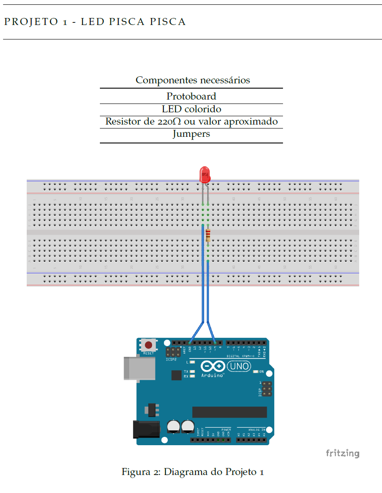
  <br>
  <em>Figura 2: Diagrama de montagem do Projeto 1 no Fritzing (Protoboard, Resistor 220Ω e LED no pino 9).</em>
</div>

> **Engenharia da Computação — Laboratório de Hardware e Circuitos Arduino**  
> **Componentes necessários:** Protoboard, LED colorido, Resistor de 220Ω (ou valor aproximado), Jumpers.  
> **Enunciado:** Montar o circuito básico de temporização digital com acendimento e desligamento periódico de 1 segundo (1000ms). Expandir a lógica para controle de intervalo parametrizado e criação de semáforo de 3 tempos.

#### Link do Código:
- 🔗 [`Projeto_01_Media_Notas_Serial.ino`](./03_Automacao_Microcontroladores_Arduino/Projeto_01_Media_Notas_Serial/Projeto_01_Media_Notas_Serial.ino)

#### Resolução Integrada (Código Fonte 2.1 & Desafios):
```cpp
int ledPin = 9;

void setup() {
  pinMode(ledPin, OUTPUT);
}

void loop() {
  digitalWrite(ledPin, HIGH); // LED ligado
  delay(1000);                // intervalo de 1s
  digitalWrite(ledPin, LOW);  // LED desligado
  delay(1000);                // intervalo de 1s
}
```

---

### Média de 5 Notas via Monitor Serial

> 1-) Receber pela porta Serial do Arduino 5 notas (0 a 9), converter ASCII para inteiro, calcular a média em ponto flutuante e imprimir no Monitor Serial.

#### Link do Código:
- 🔗 [`Projeto_01_Media_Notas_Serial.ino`](./03_Automacao_Microcontroladores_Arduino/Projeto_01_Media_Notas_Serial/Projeto_01_Media_Notas_Serial.ino)

#### Resolução:
```cpp
int N1, N2, N3, N4, N5;
float M;

void setup() {
  Serial.begin(9600);
}

void loop() {
  Serial.println("Digite 5 notas (0 a 9):");
  while (Serial.available() == 0); N1 = Serial.read() - '0';
  while (Serial.available() == 0); N2 = Serial.read() - '0';
  while (Serial.available() == 0); N3 = Serial.read() - '0';
  while (Serial.available() == 0); N4 = Serial.read() - '0';
  while (Serial.available() == 0); N5 = Serial.read() - '0';
  
  M = (N1 + N2 + N3 + N4 + N5) / 5.0;
  Serial.print("Média Calculada: ");
  Serial.println(M);
  while(1);
}
```

---

### Projeto 2 — LED Pisca Pisca com Delay Decremental

<div align="center">
  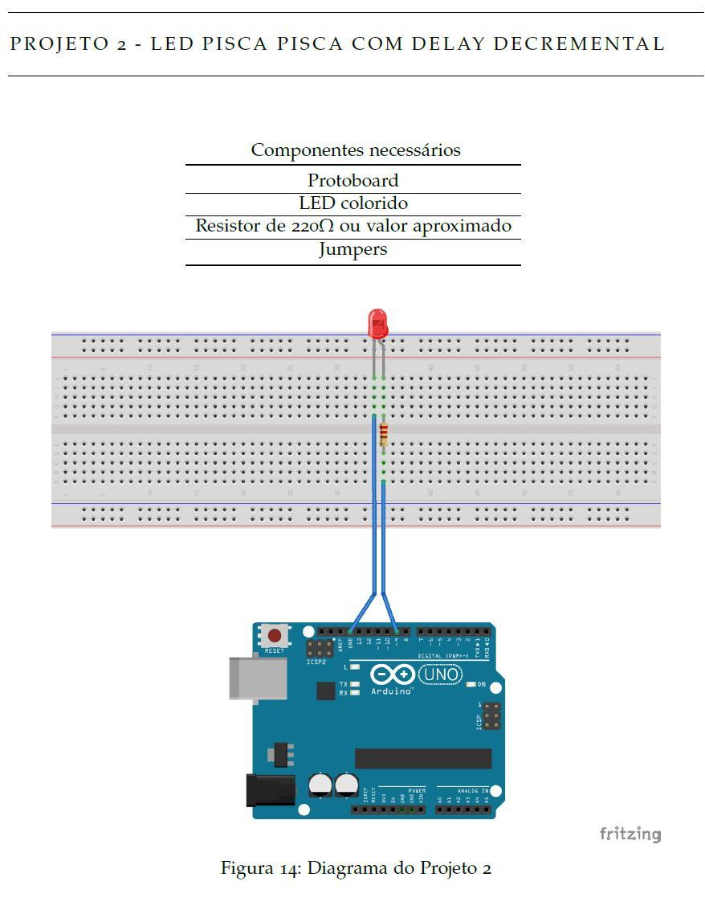
  <br>
  <em>Figura 14: Diagrama de montagem do Projeto 2 no Fritzing com controle de temporização variável.</em>
</div>

> **Engenharia da Computação — Laboratório de Hardware e Circuitos Arduino**  
> **Componentes necessários:** Protoboard, LED colorido, Resistor de 220Ω, Jumpers.  
> **Enunciado:** Desenvolver rotina com laço condicional onde o intervalo de piscada inicia em 2000ms e reduz 200ms a cada ciclo. Ao atingir o limite mínimo (0ms), a variável reinicia em 2000ms.

#### Resolução:
```cpp
int ledPin = 9;
int intervalo = 2000;

void setup() {
  pinMode(ledPin, OUTPUT);
}

void loop() {
  if (intervalo <= 0) {
    intervalo = 2000;
  }
  digitalWrite(ledPin, HIGH);
  delay(intervalo);
  digitalWrite(ledPin, LOW);
  delay(intervalo);
  intervalo = intervalo - 200;
}
```

---

### Semáforo Automático Temporizado de 3 Tempos

> 2-) Controle de semáforo veicular padrão de três tempos nos pinos 8, 9 e 10 (Verde 5s, Amarelo 2s, Vermelho 5s).

#### Link do Código:
- 🔗 [`Projeto_02_Semaforo_Temporizado.ino`](./03_Automacao_Microcontroladores_Arduino/Projeto_02_Semaforo_Temporizado/Projeto_02_Semaforo_Temporizado.ino)

#### Resolução:
```cpp
const int LED_VERMELHO = 10;
const int LED_AMARELO = 9;
const int LED_VERDE = 8;

void setup() {
  pinMode(LED_VERMELHO, OUTPUT);
  pinMode(LED_AMARELO, OUTPUT);
  pinMode(LED_VERDE, OUTPUT);
}

void loop() {
  digitalWrite(LED_VERDE, HIGH); delay(5000); digitalWrite(LED_VERDE, LOW);
  digitalWrite(LED_AMARELO, HIGH); delay(2000); digitalWrite(LED_AMARELO, LOW);
  digitalWrite(LED_VERMELHO, HIGH); delay(5000); digitalWrite(LED_VERMELHO, LOW);
}
```

---

### Projeto 3 — Luz Pulsante (Modulação PWM Incremental)

<div align="center">
  
  <br>
  <em>Figura 15: Diagrama do Projeto 3 utilizando saída analógica simulada (PWM no pino digital ~9).</em>
</div>

> **Engenharia da Computação — Laboratório de Hardware e Circuitos Arduino**  
> **Componentes necessários:** Protoboard, LED colorido, Resistor de 220Ω, Jumpers.  
> **Enunciado:** Gerar efeito "fading / respiração" variando a intensidade do LED de 0 a 255 com incrementos de 1 unidade a cada 15ms através de `analogWrite()`.

#### Resolução:
```cpp
int ledPin = 9;
int intensidade = 0;

void setup() {
  pinMode(ledPin, OUTPUT);
}

void loop() {
  if (intensidade == 255) {
    intensidade = 0;
  }
  analogWrite(ledPin, intensidade);
  delay(15);
  intensidade = intensidade + 1;
}
```

---

### Semáforo de Veículos e Pedestres com Acionamento por Botão

> 3-) Cruzamento inteligente com semáforo de veículos e semáforo de pedestres acionado por botão com fase de alerta piscante.

#### Link do Código:
- 🔗 [`Projeto_03_Semaforo_Pedestres_Botao.ino`](./03_Automacao_Microcontroladores_Arduino/Projeto_03_Semaforo_Pedestres_Botao/Projeto_03_Semaforo_Pedestres_Botao.ino)

#### Resolução:
```cpp
const int CAR_RED = 12, CAR_YELLOW = 11, CAR_GREEN = 10;
const int PED_RED = 9, PED_GREEN = 8, BUTTON = 2;

void setup() {
  pinMode(CAR_RED, OUTPUT); pinMode(CAR_YELLOW, OUTPUT); pinMode(CAR_GREEN, OUTPUT);
  pinMode(PED_RED, OUTPUT); pinMode(PED_GREEN, OUTPUT); pinMode(BUTTON, INPUT_PULLUP);
}

void loop() {
  digitalWrite(CAR_GREEN, HIGH); digitalWrite(PED_RED, HIGH);
  if (digitalRead(BUTTON) == LOW) {
    delay(1000);
    digitalWrite(CAR_GREEN, LOW); digitalWrite(CAR_YELLOW, HIGH); delay(2000);
    digitalWrite(CAR_YELLOW, LOW); digitalWrite(CAR_RED, HIGH);
    digitalWrite(PED_RED, LOW); digitalWrite(PED_GREEN, HIGH); delay(5000);
    digitalWrite(PED_GREEN, LOW);
    for (int i = 0; i < 5; i++) {
      digitalWrite(PED_RED, HIGH); delay(250);
      digitalWrite(PED_RED, LOW); delay(250);
    }
  }
}
```

---

### Projeto 4 — Meu Primeiro Botão (Pushbutton & Chave Tátil)

<div align="center">
  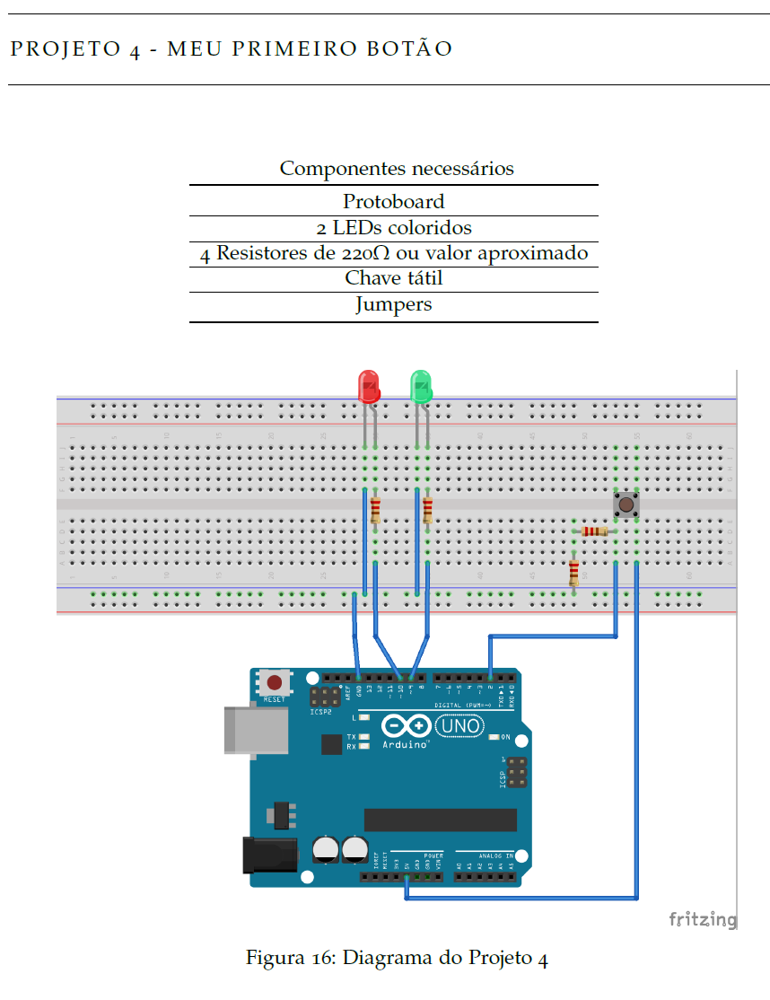
  <br>
  <em>Figura 16: Diagrama do Projeto 4 com chave tátil no pino digital 2 e dois LEDs de status.</em>
</div>

> **Engenharia da Computação — Laboratório de Hardware e Circuitos Arduino**  
> **Componentes necessários:** Protoboard, 2 LEDs coloridos, 4 Resistores de 220Ω, Chave tátil, Jumpers.  
> **Enunciado:** Leitura de entrada digital com botão (pino 2 com pull-down). A cada acionamento, alternar os estados dos LEDs Verde e Vermelho.

#### Resolução:
```cpp
int ledVerde = 9;
int ledVermelho = 10;
int pinoBotao = 2;

void setup() {
  pinMode(ledVerde, OUTPUT);
  pinMode(ledVermelho, OUTPUT);
  pinMode(pinoBotao, INPUT);
  digitalWrite(ledVerde, HIGH);
  digitalWrite(ledVermelho, LOW);
}

void loop() {
  int apertou = digitalRead(pinoBotao);
  if (apertou == HIGH) {
    digitalWrite(ledVerde, LOW);
    digitalWrite(ledVermelho, HIGH);
    delay(500);
    digitalWrite(ledVerde, HIGH);
    digitalWrite(ledVermelho, LOW);
  }
}
```

---

### Controle de Brilho de LED com Modulação PWM e Potenciômetro

> 4-) Dimmer de LED via PWM lendo potenciômetro na porta analógica A0 (0-1023) e mapeando para saída PWM no pino 9 (0-255).

#### Link do Código:
- 🔗 [`Projeto_04_Controle_Brilho_PWM_LED.ino`](./03_Automacao_Microcontroladores_Arduino/Projeto_04_Controle_Brilho_PWM_LED/Projeto_04_Controle_Brilho_PWM_LED.ino)

#### Resolução:
```cpp
const int PINO_POT = A0, PINO_LED = 9;

void setup() {
  pinMode(PINO_LED, OUTPUT);
}

void loop() {
  int valor_pot = analogRead(PINO_POT);
  int valor_pwm = map(valor_pot, 0, 1023, 0, 255);
  analogWrite(PINO_LED, valor_pwm);
  delay(50);
}
```

---

### Projeto 5 — LED Controlado por Potenciômetro (Entrada Analógica A5)

<div align="center">
  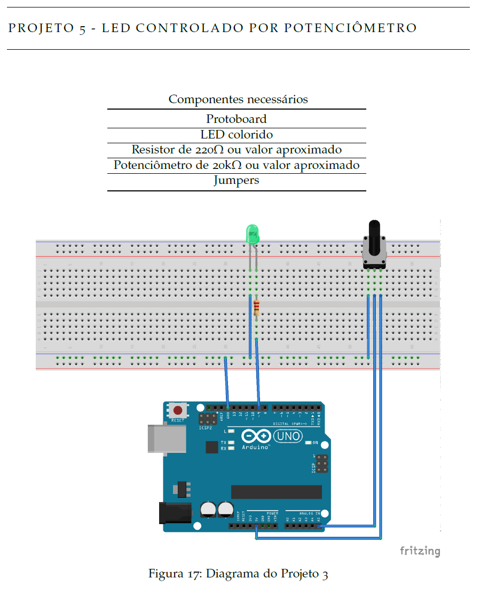
  <br>
  <em>Figura 17: Diagrama do Projeto 5 com potenciômetro de 20kΩ na entrada analógica A5.</em>
</div>

> **Engenharia da Computação — Laboratório de Hardware e Circuitos Arduino**  
> **Componentes necessários:** Protoboard, LED colorido, Resistor de 220Ω, Potenciômetro de 20kΩ, Jumpers.  
> **Enunciado:** Ler tensão analógica de 0 a 5V (resolução 10 bits: 0 a 1023) na porta A5, mapear proporcionalmente para escala PWM de 8 bits (0 a 255) e modular o brilho do LED inversamente ou diretamente.

#### Resolução:
```cpp
int ledPin = 9;

void setup() {
  pinMode(ledPin, OUTPUT);
}

void loop() {
  int leitura = analogRead(A5);
  analogWrite(ledPin, 255 - (leitura / 4));
}
```

---

### Iluminação Pública Inteligente com Sensor LDR Fotoresistor

> 5-) Relé fotoelétrico lendo fotoresistor LDR em A1. Acionar lâmpada em D8 quando luminosidade for menor que o limiar (500).

#### Link do Código:
- 🔗 [`Projeto_05_Sensor_LDR_Iluminacao_Automatica.ino`](./03_Automacao_Microcontroladores_Arduino/Projeto_05_Sensor_LDR_Iluminacao_Automatica/Projeto_05_Sensor_LDR_Iluminacao_Automatica.ino)

#### Resolução:
```cpp
const int PINO_LDR = A1, PINO_RELE = 8, LIMIAR = 500;

void setup() {
  pinMode(PINO_RELE, OUTPUT);
}

void loop() {
  int luz = analogRead(PINO_LDR);
  digitalWrite(PINO_RELE, luz < LIMIAR ? HIGH : LOW);
  delay(1000);
}
```

---

### Projeto 6 — LED Inteligente com Sensor LDR

<div align="center">
  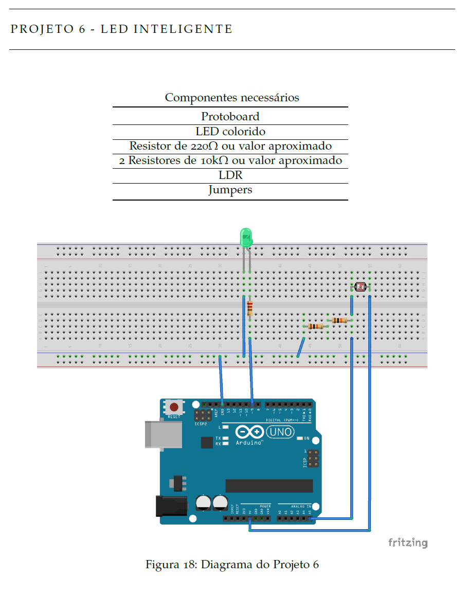
  <br>
  <em>Figura 18: Diagrama do Projeto 6 com sensor LDR em divisor de tensão resistivo.</em>
</div>

> **Engenharia da Computação — Laboratório de Hardware e Circuitos Arduino**  
> **Componentes necessários:** Protoboard, LED colorido, Resistor de 220Ω, 2 Resistores de 10kΩ, LDR, Jumpers.  
> **Enunciado:** Construir poste de iluminação pública automática: quando a luminosidade ambiente cai (leitura LDR na porta A5 menor que limiar 500), acender o LED; caso contrário, mantê-lo apagado.

#### Resolução:
```cpp
int ledPin = 9;

void setup() {
  pinMode(ledPin, OUTPUT);
}

void loop() {
  int leitura = analogRead(A5);
  if (leitura < 500) {
    digitalWrite(ledPin, HIGH);
  } else {
    digitalWrite(ledPin, LOW);
  }
}
```

---

### Contador Decimal 0 a 9 em Display de 7 Segmentos

> 6-) Controle de display de 7 segmentos nos pinos digitais 2 a 8, realizando contagem progressiva de 0 a 9 com matriz booleana.

#### Link do Código:
- 🔗 [`Projeto_06_Display_7_Segmentos_Contador.ino`](./03_Automacao_Microcontroladores_Arduino/Projeto_06_Display_7_Segmentos_Contador/Projeto_06_Display_7_Segmentos_Contador.ino)

#### Resolução:
```cpp
const int pinos[7] = {2, 3, 4, 5, 6, 7, 8};
const byte digitos[10][7] = {
  {1,1,1,1,1,1,0}, {0,1,1,0,0,0,0}, {1,1,0,1,1,0,1}, {1,1,1,1,0,0,1}, {0,1,1,0,0,1,1},
  {1,0,1,1,0,1,1}, {1,0,1,1,1,1,1}, {1,1,1,0,0,0,0}, {1,1,1,1,1,1,1}, {1,1,1,1,0,1,1}
};

void setup() {
  for (int i = 0; i < 7; i++) pinMode(pinos[i], OUTPUT);
}

void loop() {
  for (int num = 0; num <= 9; num++) {
    for (int seg = 0; seg < 7; seg++) digitalWrite(pinos[seg], digitos[num][seg]);
    delay(1000);
  }
}
```

---

### Projeto 7 — Calibrando o LED Inteligente via Monitor Serial

<div align="center">
  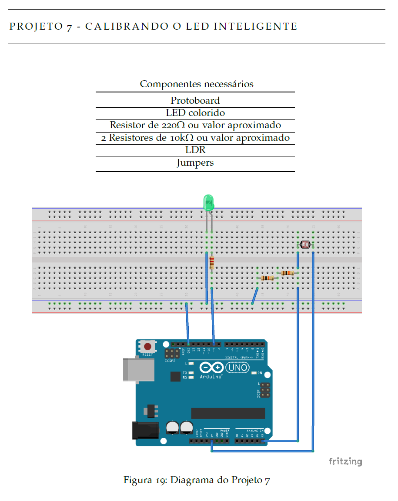
  <br>
  <em>Figura 19: Diagrama do Projeto 7 com transmissão de dados do LDR via Serial Monitor.</em>
</div>

> **Engenharia da Computação — Laboratório de Hardware e Circuitos Arduino**  
> **Componentes necessários:** Protoboard, LED, Resistor 220Ω, 2 Resistores 10kΩ, LDR, Jumpers.  
> **Enunciado:** Enviar leituras contínuas da porta analógica A5 para o computador a 9600 baud via `Serial.println()`, permitindo calibrar com exatidão o ponto de corte do acendimento do LED conforme as condições de luz da sala.

#### Resolução:
```cpp
int ledPin = 9;

void setup() {
  pinMode(ledPin, OUTPUT);
  Serial.begin(9600);
}

void loop() {
  int leitura = analogRead(A5);
  Serial.println(leitura);
  if (leitura < 500) {
    digitalWrite(ledPin, HIGH);
  } else {
    digitalWrite(ledPin, LOW);
  }
  delay(100);
}
```

---

### Sensor Ultrassônico HC-SR04 de Distância com Alarme Buzzer

> 7-) Radar de proximidade medindo distância via ultrassom (Trig D12, Echo D13). Alarme sonoro contínuo no buzzer (D11) quando distância <= 20 cm.

#### Link do Código:
- 🔗 [`Projeto_07_Sensor_Ultrassonico_Alarme_Buzzer.ino`](./03_Automacao_Microcontroladores_Arduino/Projeto_07_Sensor_Ultrassonico_Alarme_Buzzer/Projeto_07_Sensor_Ultrassonico_Alarme_Buzzer.ino)

#### Resolução:
```cpp
const int PIN_TRIG = 12, PIN_ECHO = 13, PIN_BUZZER = 11;

void setup() {
  pinMode(PIN_TRIG, OUTPUT); pinMode(PIN_ECHO, INPUT); pinMode(PIN_BUZZER, OUTPUT);
}

void loop() {
  digitalWrite(PIN_TRIG, LOW); delayMicroseconds(2);
  digitalWrite(PIN_TRIG, HIGH); delayMicroseconds(10); digitalWrite(PIN_TRIG, LOW);
  
  long duracao = pulseIn(PIN_ECHO, HIGH);
  float dist = (duracao * 0.0343) / 2.0;
  
  if (dist > 0 && dist <= 20.0) tone(PIN_BUZZER, 1000);
  else noTone(PIN_BUZZER);
  delay(100);
}
```

---

<a id="automação-de-circuitos-e-controle-de-leds-com-arduino"></a>
### Projeto 8 — LEDs Controlados pelo Teclado via Porta Serial

<div align="center">
  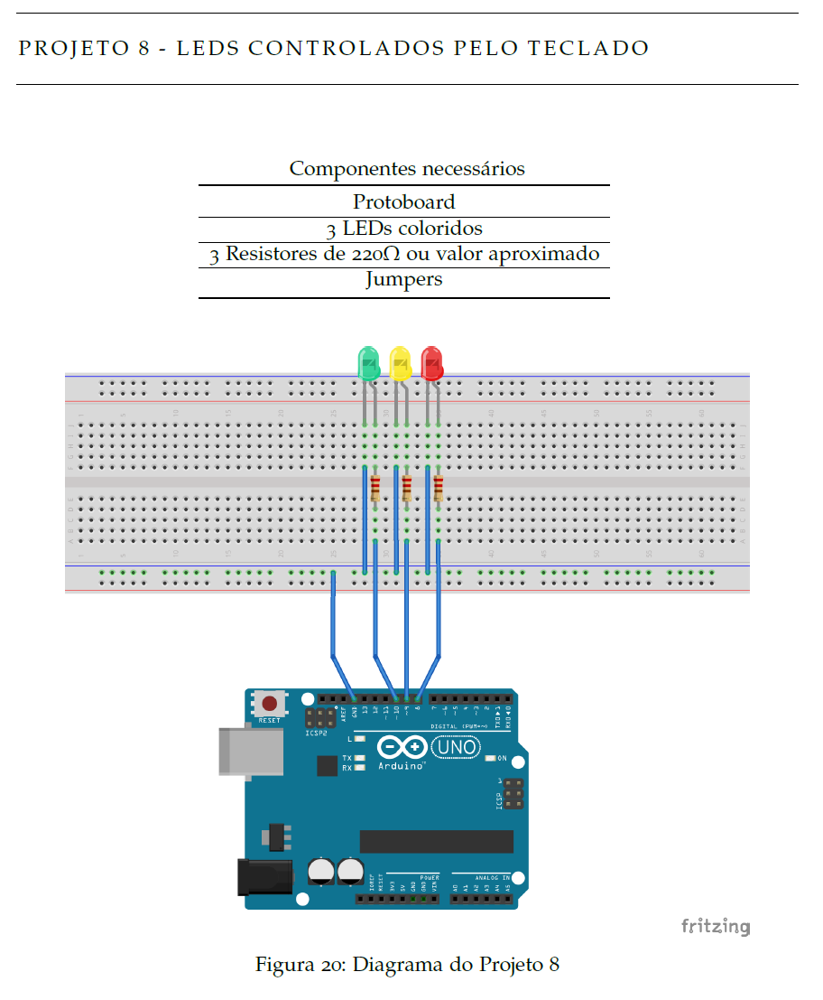
  <br>
  <em>Figura 20: Diagrama do Projeto 8 com acionamento seletivo de 3 LEDs nos pinos 8, 9 e 10.</em>
</div>

> **Engenharia da Computação — Laboratório de Hardware e Circuitos Arduino**  
> **Componentes necessários:** Protoboard, 3 LEDs coloridos, 3 Resistores de 220Ω, Jumpers.  
> **Enunciado:** Receber comandos numéricos via terminal serial do computador (`1`, `2` ou `3`). Acionar apenas o LED correspondente digitado pelo operador, mantendo os demais apagados através de `Serial.parseInt()`.

#### Resolução:
```cpp
int ledUm = 10;
int ledDois = 9;
int ledTres = 8;
int ledAtivo;

void setup() {
  pinMode(ledUm, OUTPUT);
  pinMode(ledDois, OUTPUT);
  pinMode(ledTres, OUTPUT);
  Serial.begin(9600);
}

void loop() {
  if (Serial.available() > 0) {
    ledAtivo = Serial.parseInt();
    if (ledAtivo == 1) {
      digitalWrite(ledUm, HIGH);
      digitalWrite(ledDois, LOW);
      digitalWrite(ledTres, LOW);
    } else if (ledAtivo == 2) {
      digitalWrite(ledUm, LOW);
      digitalWrite(ledDois, HIGH);
      digitalWrite(ledTres, LOW);
    } else if (ledAtivo == 3) {
      digitalWrite(ledUm, LOW);
      digitalWrite(ledDois, LOW);
      digitalWrite(ledTres, HIGH);
    }
  }
}
```

---

### Automação de Circuitos e Controle de LEDs com Arduino

> 8-) Controle e acionamento de atuadores e sinalizadores luminosos via pinos digitais do Arduino em C++.

#### Link do Código:
- 🔗 [`Projeto_08_Automacao_Circuitos_LED.ino`](./03_Automacao_Microcontroladores_Arduino/Projeto_08_Automacao_Circuitos_LED/Projeto_08_Automacao_Circuitos_LED.ino)

#### Resolução:
```cpp
void setup() {
  pinMode(LED_BUILTIN, OUTPUT);
}

void loop() {
  digitalWrite(LED_BUILTIN, HIGH);
  delay(500);
  digitalWrite(LED_BUILTIN, LOW);
  delay(500);
}
```

---

---

---
*Repositório mantido por Guilherme ([@Guimemee](https://github.com/Guimemee)) • Bacharelado em Engenharia da Computação FIAP.*
